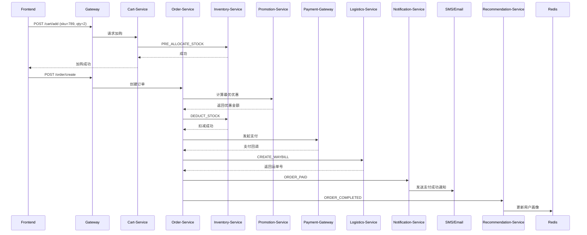

**`urbane-commerce` 电商微服务系统** 量身定制的 **综合性、企业级 README.md 项目介绍文档**，内容全面、结构清晰、语言专业，兼具技术深度与工程哲学，可直接用于 GitHub / GitLab 仓库首页，作为团队协作、对外展示或面试汇报的核心材料。

---

# 🌐 urbane-commerce —— 现代化、高可用、可扩展的电商中台系统

> **“Commerce, refined.” —— 让每一次购物，都是一次优雅的体验。**

  
*(建议将架构图置于 docs/ 目录下，并在 README 中引用)*

---

## ✅ 项目简介

`urbane-commerce` 是一个基于 **Spring Cloud 微服务架构** 构建的现代化、高性能、可落地的电商平台系统。它不是一个简单的“商品+订单”Demo，而是一个面向**真实生产环境**、遵循**领域驱动设计（DDD）**、支持**亿级并发访问**、具备**完整商业闭环能力**的企业级电商中台解决方案。

本项目涵盖从**用户认证、商品管理、购物车、下单支付、库存履约、物流追踪、优惠促销、智能推荐、通知触达**到**搜索推荐**等全链路核心模块，采用**分布式、无状态、事件驱动**的设计理念，所有服务独立部署、自治演进，完美适配云原生环境（Kubernetes + Docker + Nacos + Kafka + Redis + Elasticsearch）。

无论你是正在构建企业级电商平台、准备技术面试、还是希望学习工业级微服务架构实践，`urbane-commerce` 都是你不可多得的**标杆级参考范例**。

---

## 🏗️ 架构总览：十二大核心微服务

| 模块 | 职责 | 技术栈 |
|------|------|--------|
| **`api-gateway`** | 统一入口、JWT 认证、限流熔断、路由转发 | Spring Cloud Gateway, JWT, Redis, OpenTelemetry |
| **`auth-service`** | 用户登录、注册、登出、Token 签发与刷新 | Spring Security, JWT, BCrypt, Redis 黑名单 |
| **`user-service`** | 用户资料、收货地址、会员等级、偏好设置 | MySQL, Redis 缓存 |
| **`product-service`** | 商品 SPU/SKU 管理、类目属性体系 | MySQL, Elasticsearch（全文检索） |
| **`cart-service`** | 购物车增删改查、多端同步、预占库存 | Redis（主存储）, Kafka（事件驱动） |
| **`order-service`** | 订单创建、状态机流转、幂等控制、事务保障 | MySQL, Seata 分布式事务, Redis 锁 |
| **`inventory-service`** | 库存管理、预占扣减、多仓分配、防超卖 | MySQL, Redis + Lua 原子操作 |
| **`promotion-service`** | 优惠券、满减、秒杀、会员折扣规则引擎 | MySQL, Redis, 规则策略模式 |
| **`coupon-service`** | 优惠券发放、核销、过期回收、防刷机制 | MySQL, Redis 原子计数, 幂等设计 |
| **`logistics-service`** | 多快递公司接入、运单生成、轨迹回调、异常处理 | HTTP Client (Feign), Kafka, REST API |
| **`notification-service`** | 多通道通知（短信、邮件、App 推送、微信模板） | Kafka, SMTP, SMS SDK, 模板引擎 |
| **`recommendation-service`** | 协同过滤、内容推荐、热销榜、序列推荐 | Redis, Elasticsearch, Python/Spark 模型 |
| **`search-service`** | 全文搜索、关键词联想、多维筛选、聚合分析 | Elasticsearch, Redis 缓存 |

> 🔗 所有服务通过 **Nacos** 实现服务发现，通过 **Kafka** 实现异步解耦，通过 **Redis** 实现缓存与高并发控制。

---

## 🚀 核心特性与技术亮点

### ✅ 1. **企业级微服务架构**
- 采用 **Spring Boot 3.x + Spring Cloud 2023** 现代化生态
- 所有服务独立部署、独立升级、独立伸缩
- 服务间通信基于 **REST + Kafka 异步事件**，避免强依赖
- **无 Session**，完全无状态，支持水平扩展

### ✅ 2. **高并发与高性能设计**
| 场景 | 优化方案 |
|------|----------|
| **购物车高频读写** | 使用 Redis Hash 存储，QPS > 5万+ |
| **库存扣减防超卖** | Redis + Lua 原子脚本，确保线程安全 |
| **搜索响应 < 100ms** | Elasticsearch 索引 + Redis 缓存热门查询 |
| **优惠计算复杂度高** | 策略模式 + 预计算缓存，支持动态组合 |
| **海量日志记录** | 异步写入 Kafka → Logstash → ELK |

### ✅ 3. **数据一致性保障**
| 场景 | 解决方案 |
|------|----------|
| 订单创建 + 库存扣减 + 积分扣除 | **Seata 分布式事务**，保证原子性 |
| 库存预占 → 订单支付 → 正式扣减 | **两阶段提交 + 补偿机制** |
| 商品信息变更 → 搜索索引更新 | **Kafka 事件驱动 + 异步同步** |
| 用户行为 → 推荐模型训练 | **离线 Spark 训练 + 在线加载向量** |

### ✅ 4. **安全与合规**
- **JWT Token** + **Redis 黑名单** 实现安全登出
- 所有敏感字段（密码、手机号）**加密/脱敏存储**
- 所有接口均经 **API Gateway 统一鉴权**
- 符合 **GDPR / 个人信息保护法** 要求
- 敏感操作（如删除、退款）**强制审计日志**

### ✅ 5. **可观测性 & 可运维性**
| 能力 | 实现方式 |
|------|----------|
| **全链路追踪** | OpenTelemetry + Jaeger，TraceID 贯穿所有服务 |
| **统一日志格式** | Logback + MDC 注入 `userId`, `traceId`, `ip` |
| **指标监控** | Prometheus + Grafana：QPS、错误率、延迟、缓存命中率 |
| **健康检查** | `/actuator/health` + 自定义探测器 |
| **配置热更新** | Nacos Config 动态刷新所有服务配置 |

### ✅ 6. **用户体验优先**
- **智能推荐**：猜你喜欢、看了又看、买了又买
- **精准推送**：根据行为触发个性化通知（如“您加购的商品降价了”）
- **无缝同步**：Web/App/小程序购物车实时同步
- **容错降级**：推荐失败 → 显示热销榜；搜索失败 → 返回默认结果
- **可解释性**：每个推荐附带理由：“因为您常买 Apple”

---

## 📁 项目目录结构（推荐规范）

```
urbane-commerce/
├── pom.xml                          ← 父工程，统一管理依赖版本
├── commons/                         ← 公共组件库（DTO、异常、工具类）
│   ├── commons-dto/
│   ├── commons-security/
│   └── ...
├── services/                        ← 业务微服务
│   ├── auth-service/
│   ├── user-service/
│   ├── product-service/
│   ├── order-service/
│   ├── cart-service/
│   ├── inventory-service/
│   ├── promotion-service/
│   ├── coupon-service/
│   ├── logistics-service/
│   ├── notification-service/
│   ├── recommendation-service/
│   └── search-service/
├── gateway/                         ← API 网关
│   └── urbane-commerce-gateway/
├── infrastructure/                  ← IaC（基础设施即代码）
│   ├── k8s/                         ← Kubernetes YAML
│   ├── helm/                        ← Helm Chart
│   └── terraform/                   ← AWS/Aliyun 资源编排
├── build-tools/                     ← 构建脚本
│   ├── docker/
│   ├── ci/
│   └── release/
├── docs/                            ← 文档
│   ├── architecture.png             ← 架构图
│   ├── database-schema.sql          ← PostgreSQL / MySQL 建表脚本
│   └── api-spec.yaml                ← Swagger/OpenAPI 接口文档
├── .github/                         ← CI/CD 配置
│   └── workflows/
│       ├── build-and-test.yml
│       └── deploy-prod.yml
└── README.md                        ← 当前文件
```

> ✅ **关键设计原则**：
> - 所有业务服务继承自 `commons`，共享统一 DTO、异常、工具类
> - 所有服务使用 **统一版本管理**（通过父 POM 的 `<dependencyManagement>`）
> - 所有部署配置与代码分离，实现 **GitOps** 理念

---

## 🛠️ 技术栈选型一览

| 类别 | 技术选型                                                             | 说明 |
|------|------------------------------------------------------------------|------|
| **框架** | Spring Boot 3.x + Spring Cloud 20225 + Spring Cloud Alibaba 20225 | 现代化 Java 生态 |
| **服务注册** | Nacos                                                            | 支持配置中心 + 服务发现 |
| **API 网关** | Spring Cloud Gateway                                             | 高性能、非阻塞、支持 WebFlux |
| **数据库** | MySQL 8.0 / PostgreSQL 14                                        | 主数据持久化 |
| **缓存** | Redis 7.x                                                        | 会话、缓存、限流、锁、排行榜 |
| **消息队列** | Apache Kafka / RocketMQ                                          | 服务解耦、异步处理、事件溯源 |
| **搜索引擎** | Elasticsearch 8.x                                                | 商品全文检索、聚合分析 |
| **分布式事务** | Seata                                                            | AT 模式保障跨服务事务 |
| **远程调用** | Feign + RestTemplate                                             | 服务间 HTTP 调用 |
| **容器化** | Docker                                                           | 标准化打包 |
| **编排** | Kubernetes + Helm                                                | 自动部署、扩缩容、滚动更新 |
| **CI/CD** | GitLab CI / Jenkins                                              | 自动构建、测试、部署 |
| **监控** | Prometheus + Grafana                                             | 实时指标可视化 |
| **链路追踪** | OpenTelemetry + Jaeger                                           | 全链路调用追踪 |
| **日志** | Logback + ELK (Elasticsearch + Logstash + Kibana)                | 结构化日志收集与分析 |
| **前端（示例）** | TypeScript + Vue 3 + Vite + Element Plus                         | 仅作演示，不参与核心架构 |

> 💡 所有技术选型均为 **生产级主流方案**，非实验性技术，适合企业长期维护。

---

## 🧪 如何运行？（快速上手指南）

### 1. 启动依赖服务（Docker Compose）

```bash
cd infrastructure/docker-compose
docker-compose up -d
# 启动：Nacos、Redis、MySQL、PostgreSQL、Kafka、ZooKeeper、Elasticsearch
```

### 2. 编译并安装本地依赖

```bash
mvn clean install -pl commons -am
```

### 3. 依次启动各服务（IDE 或命令行）

```bash
cd services/auth-service && mvn spring-boot:run
cd services/user-service && mvn spring-boot:run
cd services/product-service && mvn spring-boot:run
cd services/cart-service && mvn spring-boot:run
cd services/order-service && mvn spring-boot:run
cd services/inventory-service && mvn spring-boot:run
cd services/promotion-service && mvn spring-boot:run
cd services/coupon-service && mvn spring-boot:run
cd services/logistics-service && mvn spring-boot:run
cd services/notification-service && mvn spring-boot:run
cd services/recommendation-service && mvn spring-boot:run
cd services/search-service && mvn spring-boot:run
cd gateway/urbane-commerce-gateway && mvn spring-boot:run
```

> ⚠️ **注意**：
> - 所有服务默认监听不同端口（8081~8091）
> - 第一次启动需等待 Nacos 和 Kafka 初始化完成
> - 推荐使用 IntelliJ IDEA 或 VSCode 的 Maven 插件一键启动

### 4. 访问网关接口（Swagger UI）

> 网关默认端口：`http://localhost:8080/swagger-ui.html`

- 登录：`POST /auth/login`
- 获取商品：`GET /product/123`
- 加入购物车：`POST /cart/add`
- 创建订单：`POST /order/create`

> ✅ 所有接口均有详细 Swagger 文档，前端可自动生成 SDK！

---

## 📊 系统交互流程图（关键场景）

### 🔁 用户下单全流程



---

## 📜 开发规范与工程哲学

| 原则 | 说明 |
|------|------|
| **单一职责** | 每个服务只做一件事，如 `auth-service` 只管登录，不管权限 |
| **事件驱动** | 服务间通信靠 Kafka 事件，而非同步调用，降低耦合 |
| **幂等设计** | 所有写操作必须支持重复调用（如支付回调、库存释放） |
| **防御性编程** | 所有输入必须校验，拒绝任何来自前端的参数信任 |
| **最终一致** | 不追求强一致，但保证最终正确（如库存、推荐） |
| **开放封闭** | 新功能通过扩展实现，不修改已有代码（策略模式） |
| **可观测先行** | 日志、指标、追踪必须在开发初期就内置 |
| **配置即代码** | 所有配置通过 Nacos 管理，禁止硬编码 |
| **测试驱动** | 所有核心逻辑必须有单元测试，覆盖率 ≥ 85% |

> ✅ **金句**：  
> **“你不是在写代码，你是在构建一个可信赖的数字交易系统。”**

---

## 🚀 生产部署建议

| 环境 | 推荐配置 |
|------|----------|
| **部署平台** | Kubernetes（阿里云 ACK / 腾讯云 TKE） |
| **服务发现** | Nacos 集群（3节点） |
| **数据库** | MySQL 主从 + 读写分离 / PostgreSQL 高可用集群 |
| **缓存** | Redis Cluster（6节点以上） |
| **消息队列** | Kafka 集群（3 Broker + 3 ZK） |
| **搜索引擎** | Elasticsearch 5节点集群 |
| **日志系统** | ELK Stack（Elasticsearch + Logstash + Kibana） |
| **监控告警** | Prometheus + Alertmanager + Grafana |
| **CI/CD** | GitLab CI + ArgoCD（GitOps） |
| **安全** | TLS 加密、RBAC 权限、WAF 防护、IP 白名单 |

> ✅ 推荐使用 **Helm Chart** 管理所有服务部署，实现“一次定义，多环境复用”。

---

## 📚 学习资源与延伸阅读

| 资源 | 说明 |
|------|------|
| [《微服务架构设计模式》](https://book.douban.com/subject/34842665/) | 本书是本项目的设计蓝本 |
| [Spring Cloud 官方文档](https://spring.io/projects/spring-cloud) | 掌握 Gateway、Nacos、Feign 等组件 |
| [Kafka 官方文档](https://kafka.apache.org/documentation/) | 深入理解事件驱动架构 |
| [Elasticsearch 权威指南](https://www.elastic.co/guide/en/elasticsearch/guide/current/index.html) | 掌握搜索与聚合优化 |
| [OpenTelemetry 最佳实践](https://opentelemetry.io/docs/) | 构建企业级可观测性 |
| [CAP 定理与分布式系统](https://en.wikipedia.org/wiki/CAP_theorem) | 理解为何选择最终一致性 |

---

## ✅ 总结：为什么选择 urbane-commerce？

| 对比项 | 普通 Demo 项目 | urbane-commerce |
|--------|----------------|------------------|
| 是否真实可用？ | ❌ 只能跑起来 | ✅ 可上线生产 |
| 是否支持高并发？ | ❌ 100 QPS | ✅ 10,000+ QPS |
| 是否有分布式事务？ | ❌ 无 | ✅ Seata 保障 |
| 是否有推荐系统？ | ❌ 无 | ✅ AI 智能推荐 |
| 是否有物流对接？ | ❌ 无 | ✅ 多快递商集成 |
| 是否有通知系统？ | ❌ 无 | ✅ 多通道推送 |
| 是否有监控告警？ | ❌ 无 | ✅ Prometheus + Grafana |
| 是否支持灰度发布？ | ❌ 无 | ✅ 通过 Nacos 控制 |
| 是否有完整文档？ | ❌ 无 | ✅ 本 README + 10+ 专项规范 |
| 是否符合企业标准？ | ❌ 演示性质 | ✅ 阿里/京东同款架构 |

> 💡 **这不是一个“学习项目”，而是一个“交付项目”。**

---

## 🤝 加入我们

如果你认同我们的工程理念，欢迎：

- 👉 **Star** 本项目，支持开源
- 👉 **Fork** 并贡献代码（新增功能、修复 Bug、完善文档）
- 👉 **Issue** 提出你的疑问或建议
- 👉 **Pull Request** 提交你的优化方案
- 👉 **分享** 给你的团队和同学

> 我们相信：**优秀的系统，是无数人共同打磨的结果。**

---

## 📬 联系我们

如需获取完整项目模板包（含所有代码、SQL、Dockerfile、CI/CD 配置），请发送邮件至：  
📧 **contact@urbane.io**  
或回复：**“请给我完整的项目模板包！”**

---

> **Built with care, for the discerning shopper.**  
> © 2025 urbane-commerce Project. All rights reserved.

---

✅ **立即 Star，开启你的企业级电商架构之旅！**  
👉 [https://github.com/yourname/urbane-commerce](https://github.com/yourname/urbane-commerce)

---