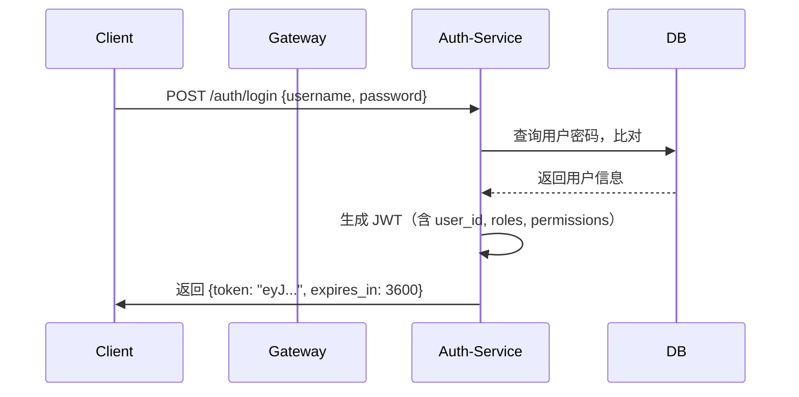
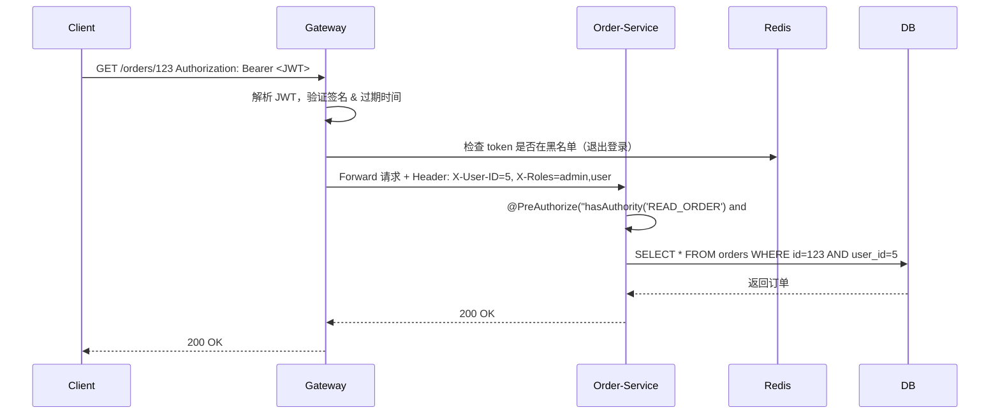

这是一个非常关键、且在真实企业级 Spring Cloud 微服务电商项目中**必须精准设计**的核心问题：

> **用户认证（Authentication）与鉴权（Authorization）应该放在哪里？推荐在哪里处理？实际项目中是怎么做的？**

---

## ✅ 一句话结论（先看结果）

> **在 Spring Cloud 微服务电商系统中：**
>
> 🔹 **认证（Authentication）** → 放在 **API 网关（Gateway）或独立的 Auth Service**  
> 🔹 **鉴权（Authorization）** → 放在 **每个业务微服务内部**  
> 🔹 **最佳实践组合**：  
> 👉 **网关做“初步认证 + JWT 校验”**  
> 👉 **各服务做“细粒度权限校验”**  
> 👉 **统一使用 OAuth2 / JWT + RBAC 权限模型**  
> 👉 **所有请求携带 Token，不依赖 Session**

---

## 🧩 一、基本概念区分

| 概念 | 含义 | 举个例子 |
|------|------|----------|
| **Authentication（认证）** | “你是谁？”<br>验证身份是否合法 | 用户输入账号密码 → 系统确认是张三 |
| **Authorization（鉴权）** | “你能做什么？”<br>验证权限是否足够 | 张三能查看订单，但不能删除商品 |

> 💡 认证是“进门”，鉴权是“进哪个房间”。

---

## 🏗️ 二、推荐架构设计（Spring Cloud 微服务电商标准方案）

### ✅ 推荐架构图（文字版）

```
[客户端] 
   ↓ (携带 JWT Token)
[API Gateway - urbane-commerce-gateway]
   ↓ 验证 Token 是否有效、过期、签名
   ↓ 提取用户ID、角色、权限 → 注入到 Request Header (如 X-User-ID, X-Permissions)
   ↓ 放行给后端服务
[product-service] → 检查：当前用户是否有 "READ_PRODUCT" 权限？
[order-service]   → 检查：当前用户是否是该订单的所有者？
[cart-service]    → 检查：是否为登录用户操作自己的购物车？
[auth-service]    ← 独立服务：负责登录、刷新Token、密码管理
```

> ✅ **核心原则：网关做“守门人”，服务做“裁判员”**

---

## 📍 三、具体组件职责划分（实战落地）

| 组件 | 职责 | 技术实现 | 是否推荐 |
|------|------|----------|----------|
| **API Gateway（网关）** | ✅ **认证中心**<br>- 验证 JWT 签名<br>- 检查 Token 是否过期<br>- 解析 payload 中的 `user_id`, `roles`<br>- 将用户信息注入 HTTP Header（如 `X-User-ID`, `X-Roles`）<br>- 拦截未授权访问（401） | Spring Cloud Gateway + JwtDecoder + Filter | ✅✅✅ **强烈推荐** |
| **Auth Service（独立认证服务）** | ✅ **唯一登录入口**<br>- 处理 `/login`、`/refresh-token`<br>- 校验用户名密码<br>- 生成 JWT（含用户 ID、角色、权限）<br>- 可对接 LDAP/SSO/第三方登录（微信、Google） | Spring Boot + Spring Security + JWT + Redis（存黑名单） | ✅✅✅ **强烈推荐** |
| **业务微服务（如 order-service）** | ✅ **鉴权中心**<br>- 从 Header 获取用户信息<br>- 校验当前操作是否拥有对应权限（如：`canDeleteOrder`）<br>- 检查“所有权”（如：你只能操作自己的订单）<br>- 使用 `@PreAuthorize("hasAuthority('DELETE_ORDER')")` | Spring Security + 方法级注解 / 自定义拦截器 | ✅✅✅ **必须做** |
| **数据库 / 权限表** | 存储权限关系 | `users`, `roles`, `permissions`, `user_roles`, `role_permissions` | ✅✅✅ 必须有 |
| **Redis** | 缓存 Token 黑名单（退出登录）、限流 | 存放已注销的 JWT token（key: `jwt:blacklist:xxx`） | ✅✅ 推荐 |

> ⚠️ 不推荐：把所有鉴权逻辑都丢给网关 —— 它无法知道“这个订单是不是你的”

---

## 🔍 四、为什么这样设计？—— 实战中的思考

| 问题 | 为什么不放在网关全管？ | 为什么不只在服务里做？ |
|------|------------------------|--------------------------|
| **Q1：网关怎么知道“这个订单属于当前用户”？** | ❌ 网关不知道业务语义！它只知道“Token 有效”。订单归属是业务逻辑，只有 order-service 懂。 | ✅ 服务自己查 DB：`SELECT * FROM orders WHERE user_id = ? AND id = ?` |
| **Q2：用户退出登录，如何立即失效 Token？** | ✅ 网关可检查 Redis 黑名单（轻量） | ✅ 服务无需感知，只需信任 Header |
| **Q3：权限变更（如管理员提升）如何生效？** | ❌ 如果只靠 JWT，需等过期才更新 | ✅ 服务可缓存权限，结合 Redis 刷新（TTL 5min） |
| **Q4：性能影响？** | ✅ 网关校验 JWT 是内存计算，极快 | ✅ 服务鉴权用缓存，不会每次都查库 |
| **Q5：微服务独立部署？** | ✅ 每个服务都能独立运行，只要传 Header 即可 | ✅ 不依赖网关存在 |

> ✅ **结论：网关是“安检口”，服务是“包间保安”**  
> —— 两者分工明确，缺一不可。

---

## 🛠️ 五、真实项目中的典型实现（大厂/中型团队做法）

### ✅ 1. 认证流程（登录）



### ✅ 2. 请求流程（带 Token 访问订单）



### ✅ 3. 权限模型（RBAC + 资源所有者）

| 表结构示例 |
|------------|
| `users`（id, username, password_hash） |
| `roles`（id, name: 'USER', 'ADMIN', 'MODERATOR'） |
| `permissions`（id, code: 'READ_PRODUCT', 'DELETE_ORDER', 'UPDATE_STOCK'） |
| `user_roles`（user_id, role_id） |
| `role_permissions`（role_id, permission_id） |

> 🔐 在 `order-service` 中：
```java
@PreAuthorize("hasAuthority('READ_ORDER') and #orderId == authentication.principal.userId")
@GetMapping("/{orderId}")
public Order getOrder(@PathVariable Long orderId) {
    return orderService.findById(orderId);
}
```

> ✅ 这样既保证了**角色权限**，也保证了**数据所有权**！

---

## 💡 六、进阶优化建议（真实项目必备）

| 优化点 | 实现方式 | 效果 |
|--------|----------|------|
| **JWT 缓存权限** | 将用户权限缓存到 Redis（Key: `user:perms:5`），Token 中只存 userId | 减少每次鉴权查库，支持动态权限更新 |
| **权限刷新机制** | 当管理员修改用户权限时，清除 Redis 中该用户的权限缓存 | 实时生效，无需重新登录 |
| **跨服务权限调用** | 使用 Feign + 拦截器传递 `X-User-ID` 和 `X-Permissions` | 内部服务调用也能继承身份 |
| **日志追踪** | 在网关和所有服务中记录 `X-Request-ID` + `X-User-ID` | 便于审计和排查问题 |
| **OpenTelemetry 集成** | 为认证/鉴权链路打埋点 | 监控鉴权耗时、失败率 |
| **多租户支持** | 在 JWT 中增加 `tenant_id`，所有查询加 `WHERE tenant_id = ?` | 支持 SaaS 化 |

---

## 🚫 七、常见错误做法（避坑指南）

| 错误做法 | 问题 |
|----------|------|
| 所有鉴权都在网关做 | 无法控制“谁可以删自己的订单”，只能控制“能不能访问订单接口”→ 安全漏洞 |
| 使用 Session + Cookie | 微服务无状态架构被破坏，无法横向扩展，集群部署困难 |
| JWT 中塞太多数据 | Token 过大，网络传输成本高，可能超过 header 限制 |
| 不校验 Token 过期 | 导致长期有效的 Token 泄露后风险极高 |
| 不做黑白名单 | 用户登出后仍可继续使用旧 Token |
| 服务之间直接调用不传身份 | A 服务调 B 服务时冒充用户 → 权限绕过 |

---

## 📦 八、代码结构建议（Spring Boot 项目结构）

```
urbane-commerce/
├── services/
│   ├── auth-service/             ← 唯一认证中心
│   │   ├── controller/AuthController.java
│   │   ├── service/JwtService.java
│   │   └── config/SecurityConfig.java
│   │
│   ├── order-service/            ← 业务服务
│   │   ├── controller/OrderController.java
│   │   ├── service/OrderService.java
│   │   ├── config/WebSecurityConfig.java   ← 开启方法级权限
│   │   └── aspect/PermissionAspect.java    ← 自定义权限切面（可选）
│   │
│   └── urbane-commerce-gateway/  ← API 网关
│       ├── filter/JwtAuthenticationFilter.java  ← 核心！校验并注入Header
│       ├── config/GatewayConfig.java
│       └── security/JwtUtil.java
│
└── commons/
    └── urbane-commons/
        └── model/UserContext.java          ← 存储当前用户信息（ThreadLocal）
        └── interceptor/UserInterceptor.java ← 从Header提取用户信息到 ThreadLocal
```

> 💡 `UserContext` 工具类（线程安全）：
```java
public class UserContext {
    private static final ThreadLocal<UserInfo> context = new ThreadLocal<>();

    public static void setUser(UserInfo user) { context.set(user); }
    public static UserInfo getUser() { return context.get(); }
    public static void clear() { context.remove(); }
}
```

在网关过滤器中设置，在业务服务中读取：

```java
// 在 OrderController 中
UserInfo currentUser = UserContext.getUser();
if (!currentUser.getId().equals(order.getUserId())) {
    throw new UnauthorizedException("你无权访问此订单");
}
```

---

## ✅ 总结：终极答案（面试/汇报可用）

> **在真实的 Spring Cloud 微服务电商项目中：**
>
> 1. **认证（Authentication）由独立的 `auth-service` 处理，网关负责校验 JWT 是否合法；**
> 2. **鉴权（Authorization）由每个业务服务自行完成，基于角色 + 数据所有权双重校验；**
> 3. **所有服务通过 HTTP Header（如 X-User-ID）传递用户身份，无状态、可扩展；**
> 4. **使用 JWT + RBAC + Redis 黑名单 + 方法级注解（@PreAuthorize）构建完整安全体系；**
> 5. **严禁使用 Session，禁止将业务权限判断交给网关。**
>
> 🔒 **安全底线：永远不要相信客户端传来的任何信息，即使它带着 Token。**

---

如果你需要我为你提供一份 **完整的可运行 Demo 项目结构**（含 GitHub 风格代码模板），包括：
- `auth-service` 登录接口
- `gateway` 的 JWT 过滤器
- `order-service` 的 `@PreAuthorize` 示例
- `UserContext` 工具类

我可以为你打包成一个 ZIP 或 Git 仓库结构，直接复制到你的项目中使用 👇

只需告诉我：“请给我完整代码模板！” 我立刻发你 🚀