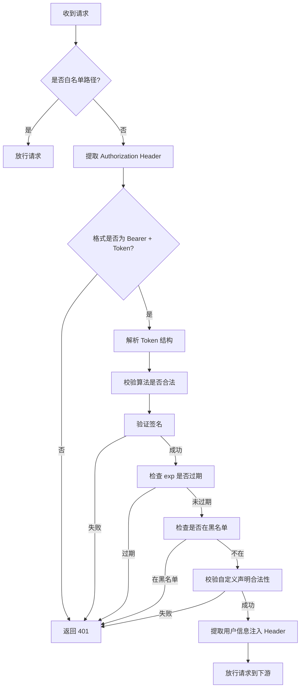

网关的**JWT验签**远不止“验证签名”这一层，它是一个包含多层逻辑的校验流程，目的是确保 Token 的合法性、时效性和安全性。以下是完整的验签维度拆解：

### 1. 🧩 基础校验：签名验证（核心）

- **做什么**：用网关本地缓存的密钥（或公钥，如 RS256）验证 Token 的签名，确保 Token 未被篡改。
- **为什么**：如果签名不匹配，说明 Token 被伪造（比如攻击者修改了 payload 里的 `user_id` 或 `roles`），必须直接拒绝。
- **技术实现**：通过 JWT 库（如 `java-jwt`、`jjwt`）调用 `JWTVerifier.verify(token)` 方法，底层会对 Header（声明算法）和
  Payload（声明内容）做 HMAC 或 RSA 签名比对。

### 2. ⏰ 时间有效性校验（关键）

JWT 内置了两个时间声明：

- `exp`（Expiration Time）：过期时间（Unix 时间戳）。**必须校验是否已过期**，否则 Token 可被无限复用。
- `nbf`（Not Before）：生效时间。**可选校验**，适用于“预约生效”的场景（如 Token 5 分钟后才允许使用）。
- **网关职责**：在签名验证通过后，额外检查 `exp` 是否大于当前时间（需处理时区问题，JWT 默认使用 UTC 时间戳）。
- **注意**：很多 JWT 库的 `verify()` 方法已内置时间校验，无需手动重复检查（如 `java-jwt` 默认会拒绝过期的 Token）。

### 3. 🔒 声明合法性校验（按需扩展）

JWT 的 `payload` 里可以自定义业务声明（如 `user_id`、`tenant_id`、`roles`），网关需根据业务规则校验这些声明：

- **必填字段检查**：如必须包含 `user_id`，否则视为非法 Token。
- **格式校验**：如 `roles` 必须是逗号分隔的字符串，`user_id` 必须是数字。
- **业务规则校验**：如某些场景要求 Token 的 `aud`（受众）必须匹配当前网关的服务名，防止 Token 被跨服务复用。
- **示例**：
  ```java
  JWT jwt = JWTUtil.parseToken(token);
  if (jwt.getPayload("user_id") == null) {
      throw new SecurityException("Token 缺少必需的 user_id 声明");
  }
  ```

### 4. 🚫 黑名单/吊销状态校验（可选但强烈建议）

- **场景**：用户主动注销、管理员强制下线、Token 被盗用等场景下，需要将 Token 加入黑名单。
- **网关职责**：校验 Token 后，额外检查其是否在黑名单中（通常通过 Redis 存储，键为 Token 的 `jti` 声明，值为过期时间）。
- **注意**：黑名单校验会引入一次 Redis 查询，需权衡性能（可通过短过期时间 + 本地缓存优化）。

### 5. 🔄 算法安全校验（防御性设计）

- **风险**：JWT 支持多种签名算法（如 `HS256`、`RS256`、`none`），攻击者可能篡改 Header 中的 `alg` 字段为 `none`（无签名），绕过验签。
- **网关职责**：强制限定允许的算法（如仅允许 `HS256` 或 `RS256`），拒绝 `alg=none` 的 Token。
- **示例**：
  ```java
  // java-jwt 中设置允许的算法
  JWTVerifier verifier = JWT.require(Algorithm.HMAC256(secretKey))
          .withIssuer("mall-cloud")
          .build();
  ```

### 6. 场景差异化校验（按需裁剪）

根据业务场景，网关可调整验签策略：

- **登录接口**：跳过验签（白名单），允许生成新 Token。
- **刷新接口**：仅校验 `refresh_token` 的有效性（可能使用不同的密钥和过期时间）。
- **内部服务调用**：使用 Service-to-Service Token，校验逻辑可能更严格（如绑定调用方 IP）。

### 总结：网关验签的完整流程



**核心原则**：验签的目的是“在网关处拦截所有非法请求”，避免无效流量打到下游服务，同时保证下游无需重复解析 Token。