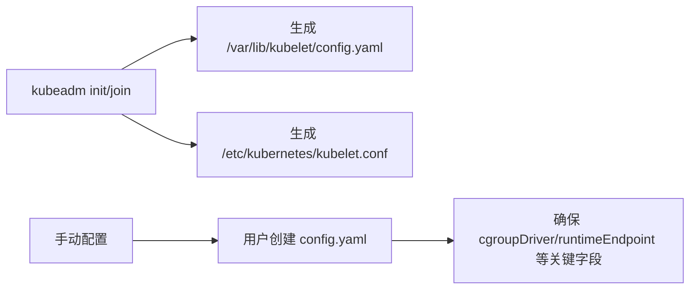

# 📘 Fedora Kubelet 配置与管理中文参考指南
> 基于 Fedora 官方文档整理 · 适配 Fedora 43 + Kubernetes 1.30+ · 结合本地实操建议

---

## 📋 文档概述

本文档系统梳理了 **Fedora 系统中 kubelet 服务的配置机制、管理策略与最佳实践**，重点解决：
- ✅ kubelet 配置方式的历史演进与当前推荐方案
- ✅ systemd 服务文件的安全修改方法（避免升级丢失配置）
- ✅ 配置文件路径、格式与合并优先级
- ✅ Fedora 43 + Podman/cri-o 环境的适配建议

> 💡 适用对象：在 Fedora 上部署/维护 Kubernetes 节点的开发人员、运维工程师

---

## 🔰 一、Kubelet 基础概念

| 项目 | 说明 |
|------|------|
| **角色定位** | Kubernetes 的「节点代理」，运行在每个集群节点上，负责管理 Pod 生命周期、上报节点状态、执行调度指令 |
| **安装方式** | 通过 Fedora RPM 包安装（如 `kubernetes1.30-kubelet`） |
| **运行模式** | 作为 `systemd` 服务运行（`kubelet.service`） |
| **核心职责** | 拉取镜像、启动容器、健康检查、资源监控、与 API Server 通信 |

---

## ⚙️ 二、配置方式演进：从 Flags 到 Config File

### 🔄 历史方式：命令行参数（已弃用）
```bash
# 旧版 systemd 单位文件中直接传参（不推荐）
ExecStart=/usr/bin/kubelet \
  --pod-manifest-path=/etc/kubernetes/manifests \
  --cluster-dns=10.96.0.10 \
  --cgroup-driver=systemd
```
⚠️ **问题**：参数分散、难以版本管理、易与运行时配置冲突

### ✅ 当前推荐：结构化配置文件（YAML/JSON）
```yaml
# /var/lib/kubelet/config.yaml 示例片段
apiVersion: kubelet.config.k8s.io/v1beta1
kind: KubeletConfiguration
cgroupDriver: systemd
containerRuntimeEndpoint: unix:///var/run/crio/crio.sock
clusterDNS:
  - 10.96.0.10
clusterDomain: cluster.local
```
✅ **优势**：
- 配置集中、可读性强、支持版本控制
- 与 `kubeadm` 等工具链无缝集成
- 支持动态配置更新（部分字段）

> 📌 **关键结论**：**Kubernetes 1.24+ 官方已弃用大部分命令行配置参数，强烈建议使用 `--config=/path/to/config.yaml` 方式启动**。

---

## 📦 三、RPM 包类型与配置差异

| RPM 包类型 | 示例 | 默认配置方式 | 配置文件路径 | 升级行为 |
|-----------|------|-------------|-------------|---------|
| **非版本化包** | `kubernetes-kubelet` | 命令行 flags | 无默认 config 文件 | 可能覆盖 systemd 文件 |
| **版本化包** ✅推荐 | `kubernetes1.30-kubelet` | config.yaml | `/var/lib/kubelet/config.yaml` | 保留用户配置文件 |

### 🔍 如何确认当前安装类型？
```bash
# 查看已安装的 kubernetes 相关包
rpm -qa | grep kubernetes

# 查看 kubelet 二进制版本
kubelet --version

# 检查 systemd 文件来源
rpm -qf /usr/lib/systemd/system/kubelet.service
```

> 💡 **建议**：优先使用**版本化 RPM 包**（如 `kubernetes1.30-*`），配置更规范、升级更安全。

---

## 🔐 四、systemd 配置最佳实践（⚠️ 重点）

### ❌ 禁止直接修改的文件
```
/usr/lib/systemd/system/kubelet.service          # 主服务文件（包管理）
/usr/lib/systemd/system/kubelet.service.d/10-kubeadm.conf  # kubeadm 注入配置
```
> 🚫 任何手动修改都可能在 `dnf update` 时被**静默覆盖**，导致配置丢失！

### ✅ 正确做法：使用 `/etc/systemd/system/` 覆盖机制

#### 步骤 1：创建用户级 drop-in 目录
```bash
sudo mkdir -p /etc/systemd/system/kubelet.service.d/
```

#### 步骤 2：编写覆盖配置文件（`.conf` 后缀必需）
```bash
# 示例：/etc/systemd/system/kubelet.service.d/override.conf
[Service]
# 补充环境变量（修复你日志中的警告）
Environment="KUBELET_KUBEADM_ARGS=--node-ip=192.168.1.100"
Environment="KUBELET_EXTRA_ARGS=--v=2"

# 如需覆盖 ExecStart，必须先清空原命令（谨慎使用！）
# ExecStart=
# ExecStart=/usr/bin/kubelet $KUBELET_KUBECONFIG_ARGS $KUBELET_CONFIG_ARGS ...
```

#### 步骤 3：重载配置并验证
```bash
sudo systemctl daemon-reload
systemctl show kubelet | grep -E "Environment|ExecStart"
```

### 🛡️ 配置安全建议
| 措施 | 说明 |
|------|------|
| ✅ 版本控制 | 将 `/etc/systemd/system/kubelet.service.d/` 纳入 git 管理 |
| ✅ 备份策略 | 升级前执行 `sudo cp -a /etc/systemd/system/kubelet.service.d/ /backup/` |
| ✅ 最小权限 | 配置文件权限设为 `644`，属主 `root:root` |
| ✅ 变更审计 | 使用 `auditd` 监控关键配置目录变更 |

---

## 🗂️ 五、配置文件管理策略

### 📍 核心配置文件路径
| 文件 | 路径 | 管理方 | 是否持久化 |
|------|------|--------|-----------|
| **主配置文件** | `/var/lib/kubelet/config.yaml` | kubeadm / 用户 | ✅ 是（rpm 不管理） |
| **kubeconfig** | `/etc/kubernetes/kubelet.conf` | kubeadm | ✅ 是 |
| **证书目录** | `/var/lib/kubelet/pki/` | kubelet 自动生成 | ✅ 是 |
| **工作目录** | `/var/lib/kubelet/` | kubelet | ✅ 是 |

### 🔁 配置文件生成时机


### 🛠️ 手动创建最小化 config.yaml（学习测试用）
```yaml
# /var/lib/kubelet/config.yaml
apiVersion: kubelet.config.k8s.io/v1beta1
kind: KubeletConfiguration
# 【Fedora 43 必填】cgroups v2 必须使用 systemd 驱动
cgroupDriver: systemd
# 【容器运行时】根据实际选择：
containerRuntimeEndpoint: unix:///var/run/crio/crio.sock
# containerRuntimeEndpoint: unix:///run/podman/podman.sock  # 需 podman 4.9+ 启用 CRI 支持
# 【网络】
clusterDNS:
  - 10.96.0.10
clusterDomain: cluster.local
# 【安全】
authentication:
  anonymous:
    enabled: false
  webhook:
    enabled: true
authorization:
  mode: Webhook
# 【日志】
v: 2  # 日志级别，调试时可设为 4-5
```

> ⚠️ 注意：手动配置无法自动加入集群，仅适用于单节点实验。生产环境务必通过 `kubeadm` 初始化。

---

## 🧩 六、Drop-in 配置目录（Kubernetes 1.30+ 新特性）

### 🔧 启用方法
1. 在 systemd 中指定 `--config-dir` 参数：
   ```bash
   # /etc/systemd/system/kubelet.service.d/override.conf
   [Service]
   Environment="KUBELET_CONFIG_ARGS=--config=/var/lib/kubelet/config.yaml --config-dir=/etc/kubernetes/kubelet.conf.d"
   ```

2. 创建 drop-in 配置目录并添加片段：
   ```bash
   sudo mkdir -p /etc/kubernetes/kubelet.conf.d
   
   # 示例：/etc/kubernetes/kubelet.conf.d/99-custom.yaml
   apiVersion: kubelet.config.k8s.io/v1beta1
   kind: KubeletConfiguration
   maxPods: 110  # 覆盖主配置中的值
   ```

### ✅ 使用场景
- 按节点类型动态注入配置（如 GPU 节点、边缘节点）
- 自动化运维工具（Ansible/ArgoCD）分层管理配置
- 临时调试参数（无需修改主配置）

> 📌 注意：drop-in 文件按**字母序合并**，`99-*.yaml` 优先级最高。

---

## 🔀 七、配置合并优先级（从高到低）

kubelet 启动时，配置按以下顺序合并，**后加载的覆盖先加载的**：

```
┌─────────────────────────────────────┐
│ 1️⃣ 命令行参数（不含 feature-gates） │ ← 最高优先级
│    --feature-gates 除外              │
├─────────────────────────────────────┤
│ 2️⃣ Drop-in 配置文件（按文件名排序）  │
│    /etc/kubernetes/kubelet.conf.d/  │
├─────────────────────────────────────┤
│ 3️⃣ 主配置文件                        │
│    /var/lib/kubelet/config.yaml     │
├─────────────────────────────────────┤
│ 4️⃣ 命令行 feature-gates 参数         │ ← 最低优先级
│    --feature-gates=XXX=true         │
└─────────────────────────────────────┘
```

### 🔍 调试技巧：查看实际生效配置
```bash
# 方法 1：kubelet 启动日志中会打印最终配置（--v=4 以上）
journalctl -u kubelet -n 50 | grep -A 20 "KubeletConfiguration"

# 方法 2：使用 kubelet 内置配置检查（需 kubelet 运行中）
curl -s http://localhost:10248/configz | jq .

# 方法 3：手动模拟合并（高级）
kubelet --config=/var/lib/kubelet/config.yaml --v=5 2>&1 | grep "effective config"
```

---

## 🐧 八、Fedora 43 专属实操建议

### ✅ 环境预检清单
```bash
# 1. 确认 cgroups 版本（Fedora 43 默认 v2）
stat -fc %T /sys/fs/cgroup/  # 应输出: cgroup2fs

# 2. 检查容器运行时（推荐 CRI-O）
sudo dnf install -y cri-o
sudo systemctl enable --now crio
crictl info | grep "cgroupManager"  # 应输出: systemd

# 3. 关闭干扰项（学习阶段）
sudo systemctl disable --now firewalld    # 或开放必要端口
sudo setenforce 0                         # 临时关闭 SELinux 测试
```

### 🔧 修复你当前的 kubelet 启动问题
结合你之前的日志，执行以下命令快速修复：

```bash
# 1. 创建配置目录
sudo mkdir -p /var/lib/kubelet

# 2. 生成最小化 config.yaml（适配 Fedora 43 + CRI-O）
sudo tee /var/lib/kubelet/config.yaml > /dev/null << 'EOF'
apiVersion: kubelet.config.k8s.io/v1beta1
kind: KubeletConfiguration
cgroupDriver: systemd
containerRuntimeEndpoint: unix:///var/run/crio/crio.sock
clusterDNS:
  - 10.96.0.10
clusterDomain: cluster.local
authentication:
  anonymous: { enabled: false }
  webhook: { enabled: true }
authorization: { mode: Webhook }
v: 2
EOF

# 3. 修复 systemd 环境变量警告
sudo mkdir -p /etc/systemd/system/kubelet.service.d/
sudo tee /etc/systemd/system/kubelet.service.d/override.conf > /dev/null << 'EOF'
[Service]
Environment="KUBELET_KUBEADM_ARGS="
Environment="KUBELET_CONFIG_ARGS=--config=/var/lib/kubelet/config.yaml"
EOF

# 4. 重载并启动
sudo systemctl daemon-reload
sudo systemctl reset-failed kubelet  # 清除 572 次失败计数
sudo systemctl enable --now kubelet

# 5. 验证
systemctl status kubelet --no-pager
journalctl -u kubelet -n 20 --no-pager
```

### 🚀 替代方案：使用 Kind + Podman（推荐本地开发）
如果目标仅是**本地开发测试**（如部署你的 Spring Boot 博客项目），强烈建议跳过底层配置：

```bash
# 1. 安装 kind（支持 Podman 后端）
curl -Lo ./kind https://kind.sigs.k8s.io/dl/v0.24.0/kind-linux-amd64
chmod +x ./kind && sudo mv ./kind /usr/local/bin/

# 2. 一键创建集群（自动处理 kubelet/cri/cgroup 所有细节）
kind create cluster \
  --name dev \
  --image kindest/node:v1.30.0 \
  --config <(cat <<EOF
kind: Cluster
apiVersion: kind.x-k8s.io/v1alpha4
nodes:
- role: control-plane
  extraMounts:
  - hostPath: /tmp/registry
    containerPath: /tmp/registry
EOF
)

# 3. 验证 & 使用
kubectl cluster-info
kubectl get nodes
# 你的 ~/.kube/config 已自动配置好
```

✅ **优势**：
- 完全隔离，不影响主机 systemd/kubelet
- 支持多集群、快速销毁重建
- 完美兼容 Fedora 43 + Podman

---

## 🚨 九、常见问题速查表

| 现象 | 可能原因 | 解决方案 |
|------|---------|---------|
| `config.yaml: no such file` | 未执行 kubeadm / 手动配置缺失 | 按「八-2」生成配置文件 |
| `cgroup driver mismatch` | kubelet 用 systemd，runtime 用 cgroupfs | 统一为 `cgroupDriver: systemd` + `crio config` 中 `cgroup_manager = "systemd"` |
| `CRI connection failed` | CRI-O 未启动 / 套接字路径错误 | `systemctl status crio` + 检查 `containerRuntimeEndpoint` |
| `KUBELET_KUBEADM_ARGS unset` | systemd drop-in 引用未定义变量 | 在 override.conf 中显式赋空值或正确值 |
| 节点状态 `NotReady` | CNI 插件未安装 / 网络不通 | `kubectl apply -f calico.yaml` + 检查防火墙 |

---

## 📎 附录：关键命令速查

```bash
# 🔍 诊断类
systemctl status kubelet --no-pager
journalctl -u kubelet -n 50 --no-pager -f
kubelet --version
crictl info | head -20

# ⚙️ 配置类
sudo systemctl edit kubelet          # 交互式创建 override.conf
systemctl show kubelet | grep Environment
ls -la /var/lib/kubelet/

# 🔄 管理类
sudo systemctl daemon-reload
sudo systemctl reset-failed kubelet
sudo systemctl restart kubelet

# 🧪 调试类（前台运行，实时看日志）
sudo kubelet --config=/var/lib/kubelet/config.yaml --v=4
```

---

> 🌟 **最后建议**：  
> 如果你正在学习 Kubernetes，**优先使用 Kind/Minikube + Podman 驱动**，可节省 90% 的底层配置时间；  
> 如果需要深入理解节点运维，再按本指南手动配置 kubelet，逐步掌握 systemd + CRI + cgroups 的协同机制。

需要我为你生成：
- ✅ 一份可直接执行的「Fedora 43 + CRI-O + kubeadm 初始化脚本」？
- ✅ 一个适配你博客项目的 `kind-cluster.yaml` 配置文件？
- ✅ kubelet config.yaml 的完整字段说明文档？

随时告诉我，我可以继续为你定制 👇