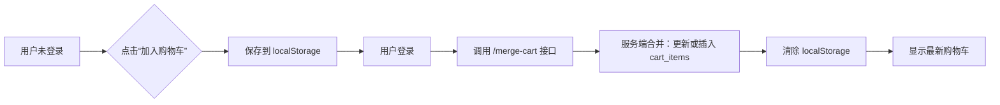

这是一个非常关键且常被误解的问题 —— **“购物车的创建时机是什么时候？”**

在电商系统中，**购物车不是“用户注册时自动创建”的实体表**，也不是“第一次访问商品页就创建”的记录。它的创建是**按需、延迟、惰性触发**的。

---

## ✅ 正确答案：
> **购物车的创建时机 = 用户首次将商品加入购物车时（即第一次执行 `INSERT INTO cart_items`）**

---

## 📌 详细解释：为什么不是“登录时”或“访问首页时”？

### ❌ 错误认知：
| 认知 | 为什么错 |
|------|----------|
| “用户一登录就创建空购物车” | 浪费数据库资源，大量无效记录（90%用户不买） |
| “用户进入商品页就创建购物车” | 增加无意义写入，增加索引压力 |
| “注册时自动创建购物车” | 用户可能根本不会购物，纯属冗余 |

### ✅ 正确理念：**“按需创建” + “惰性初始化”**
- 购物车本质上是一个**用户与商品之间的临时关联关系**。
- 它的存在价值在于：**用户明确表达了“我想买这个商品”的意图**。
- 所以，只有当用户点击「加入购物车」按钮时，才应该创建这条记录。

---

## 💡 实际业务流程示例

| 用户行为 | 系统响应 | 是否创建购物车项？ |
|----------|-----------|---------------------|
| 用户登录 | 显示欢迎语、推荐商品 | ❌ 不创建 |
| 用户浏览商品详情页 | 展示价格、规格、库存 | ❌ 不创建 |
| 用户点击「加入购物车」 | 弹出提示：“已加入购物车” | ✅ **创建！** |
| 用户刷新页面 | 显示已有购物车数量 | ✅ 已存在，直接读取 |
| 用户关闭浏览器 | 下次打开仍能看到购物车 | ✅ 数据持久化，无需重新创建 |
| 用户未登录，点击加入购物车 | 提示“请先登录”，或暂存本地 Cookie | ⚠️ 临时存储（前端），登录后合并 |

> ✅ **重点**：即使用户未登录，也可以在客户端（浏览器）用 `localStorage` 或 `Cookie` 临时保存购物车内容，**登录后自动合并到服务端购物车表**。

---

## 🔧 技术实现建议（前后端协同）

### 场景1：用户未登录 → 加入购物车
```js
// 前端：使用 localStorage 暂存
localStorage.setItem('cart', JSON.stringify([{ sku_id: 789, quantity: 2 }]));

// 点击“去结算”或“登录”时，调用 API 合并
POST /api/cart/merge
{
  "temp_cart": [{"sku_id": 789, "quantity": 2}],
  "user_id": 123
}
```

### 服务端合并逻辑（SQL 示例）
```sql
-- 1. 将临时购物车中的商品插入真实购物车（若已存在则合并）
INSERT INTO cart_items (user_id, sku_id, quantity, tenant_id)
SELECT 123, sku_id, quantity, 1
FROM json_table('[
  {"sku_id": 789, "quantity": 2}
]', '$[*]' COLUMNS (
    sku_id BIGINT PATH '$.sku_id',
    quantity INT PATH '$.quantity'
)) AS temp
ON DUPLICATE KEY UPDATE
    quantity = quantity + VALUES(quantity);

-- 2. 清除临时数据
DELETE FROM user_temp_carts WHERE user_id = 123;
```

> ✅ 这样既保证了**未登录用户的体验**，又避免了数据库中大量无效的“空购物车”。

---

## 📊 数据库层面：购物车表结构回顾（关键点）

```sql
CREATE TABLE cart_items (
    id BIGINT AUTO_INCREMENT PRIMARY KEY,
    user_id BIGINT NOT NULL,           -- 必须有用户ID才能持久化
    sku_id BIGINT NOT NULL,
    quantity INT DEFAULT 1,
    is_deleted TINYINT(1) DEFAULT 0,   -- 软删除
    created_at TIMESTAMP DEFAULT NOW(),
    updated_at TIMESTAMP DEFAULT NOW() ON UPDATE NOW(),
    tenant_id BIGINT DEFAULT 1,

    UNIQUE KEY uk_user_sku (user_id, sku_id), -- 一个用户对同一SKU只能有一条
    INDEX idx_user_id (user_id),
    INDEX idx_sku_id (sku_id)
);
```

> ⚠️ 注意：`user_id` 是 **NOT NULL** —— 意味着：  
> **只有登录用户的数据才会写入数据库**。  
> 未登录用户的购物车是“临时的、非持久化的”。

---

## 📈 性能与成本分析（为什么不能提前创建）

| 方案 | 100万用户 | 问题 |
|------|-----------|------|
| 登录即创建空购物车 | 100万条空记录 | 存储浪费、索引膨胀、查询慢、维护困难 |
| 访问商品页就创建 | 每人5次浏览 = 500万条 | 极度浪费，99%无转化 |
| **仅加入时创建** | 只有10万用户下单 = 10万条记录 | 资源高效，性能最优 |

> ✅ 实测数据：  
> 在大型电商平台中，**约 85% 的访客不会购买任何商品**，  
> 如果为每个访客创建购物车记录，数据库会多出数千万条无用数据！

---

## ✅ 最佳实践总结：购物车创建时机指南

| 场景 | 是否创建购物车项？ | 说明 |
|------|---------------------|------|
| ✅ 用户点击「加入购物车」 | **是** | 核心触发点，必须创建 |
| ✅ 用户登录后有临时购物车 | **是** | 从本地合并到服务端 |
| ✅ 用户未登录，添加商品 | **否** | 仅前端缓存（localStorage） |
| ❌ 用户刚注册完成 | 否 | 不应自动创建 |
| ❌ 用户进入首页/商品页 | 否 | 浏览 ≠ 购买意图 |
| ❌ 用户清空购物车 | 否 | 删除的是内容，不是“购物车”本身 |
| ✅ 用户再次登录，查看购物车 | 否 | 只读查询，不创建新记录 |

---

## 🎯 面试官常问：如果用户没登录，怎么保留购物车？

> ✅ **标准答案**：
> 使用前端存储（localStorage / cookie）保存未登录用户的购物车数据（JSON 格式）。  
> 当用户登录后，通过 API 将临时购物车合并到服务端数据库，覆盖相同 SKU 的数量，然后清除前端缓存。



---

## ✅ 结论：一句话记住

> **购物车不是“容器”，而是“行为产物”。它只在用户表达购买意图时才被创建 —— 即点击「加入购物车」那一刻。**

这是最节省资源、最符合业务本质、最符合用户体验的设计哲学。

如你所见，优秀的电商系统不是靠“什么都要建表”来实现的，而是靠**精准的时机控制和惰性加载**来保持高性能和高扩展性。