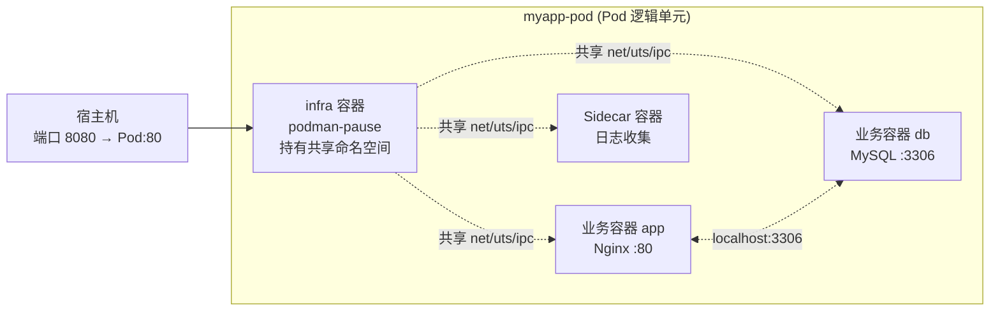

Podman 中的 **Pod 是一组共享同一组 Linux 命名空间（网络、IPC、UTS 等）的容器集合，是 Podman 对 Kubernetes Pod 概念的轻量级实现**。Pod 内的所有容器共用同一个 IP 地址和端口空间，彼此可通过 `localhost` 直接通信，像"超级容器"一样作为一个逻辑单元被统一调度和管理。
下面这张图直观展示了 Pod 内部容器如何通过 infra 容器共享命名空间：

如图所示，Pod 中默认会创建一个 `infra` 容器（基于 `podman-pause` 镜像），它的唯一职责是持有并"锚定"共享的命名空间，其他业务容器通过加入该 Pod 来复用这些命名空间，从而实现容器间的 `localhost` 互通。
---
## 一、Pod 的作用
### 1. 共享网络命名空间
Pod 内所有容器共享同一个网络栈，拥有相同的 IP 和端口空间。容器 A 监听 8080，容器 B 直接 `curl localhost:8080` 即可访问，无需端口映射或服务发现。
### 2. 共享存储与 IPC
Pod 内的容器可以共享 Volume 挂载，并通过 IPC（System V / POSIX 消息队列）进行进程间通信，适合需要共享内存或文件的高耦合场景。
### 3. 统一生命周期管理
Pod 作为一个整体被启动、停止、删除。`podman pod start/stop/rm` 会作用于 Pod 内所有容器，避免逐个管理的繁琐。
### 4. 与 Kubernetes 概念对齐
这是 Podman Pod 最具战略价值的作用。Podman 支持通过 `podman play kube` 直接运行 Kubernetes YAML 清单，也可以用 `podman generate kube` 将本地 Pod 导出为 K8s YAML，使本地开发环境能 1:1 模拟生产 K8s 集群中的 Pod 部署结构。
---
## 二、何时推荐使用 Pod
| 使用场景 | 是否推荐 | 说明 |
| :--- | :--- | :--- |
| 单个独立应用（如单个 Nginx） | ❌ 不需要 | 直接 `podman run` 即可，Pod 是多余开销 |
| 需要共享 localhost 的紧耦合多容器 | ✅ 强烈推荐 | 如 Web 应用 + 本地 Redis 缓存，通过 localhost 通信 |
| Sidecar 模式（日志/监控/代理伴随主容器） | ✅ 强烈推荐 | Pod 是 Sidecar 模式的天然载体 |
| 本地开发需模拟 Kubernetes Pod 部署 | ✅ 强烈推荐 | 用 `podman play kube` 直接跑 K8s YAML，避免起 minikube |
| 准备迁移到 Kubernetes | ✅ 强烈推荐 | 用 Pod 重组结构，再用 `generate kube` 导出 YAML 无缝迁移 |
| 容器间需要共享存储卷或 IPC | ✅ 推荐 | Pod 内共享 Volume 和 IPC 命名空间 |
| 松耦合、独立扩展的多服务 | ❌ 不推荐 | 用自定义网络 + DNS 解析更合适，Pod 内容器无法独立扩缩 |
---
## 三、完整示例：Nginx + Redis 协同的 Pod
下面模拟一个典型场景：一个 Web 应用容器需要与一个本地 Redis 缓存容器紧密协作，两者通过 `localhost` 通信。
### 1. 创建 Pod 并指定端口映射
端口映射需在 Pod 层面声明，Pod 内所有容器共享这一映射。
```bash
# 创建名为 webapp-pod 的 Pod，将宿主机 8080 映射到 Pod 的 80 端口
podman pod create --name webapp-pod -p 8080:80
```
### 2. 向 Pod 中添加第一个容器（Nginx 业务容器）
```bash
podman run -d --pod webapp-pod --name web \
  -e REDIS_HOST=127.0.0.1 \
  -e REDIS_PORT=6379 \
  nginx:alpine
```
### 3. 向 Pod 中添加第二个容器（Redis 缓存容器）
```bash
podman run -d --pod webapp-pod --name cache \
  redis:alpine
```
注意：第二个容器**不需要**再映射端口，它直接与 web 容器共享同一个网络命名空间，web 容器通过 `localhost:6379` 即可访问 Redis。
### 4. 验证 Pod 内容器互通
进入 web 容器，测试能否通过 localhost 访问 Redis：
```bash
podman exec -it web sh
# 在容器内执行
wget -qO- http://localhost:80   # 访问自身 Nginx
# 验证 Redis 连通（需容器内有 redis-cli，这里用 nc 测试端口）
nc -zv localhost 6379            # 应显示 connected
```
### 5. 查看 Pod 与容器状态
```bash
# 查看 Pod 概况
podman pod ps
# 查看 Pod 内所有容器（infra 容器也会列出）
podman ps --pod
```
输出中会看到三个容器：一个 `infra` 容器（podman-pause）、web、cache，它们共享同一个 Pod ID。
### 6. 统一管理 Pod 生命周期
```bash
podman pod stop webapp-pod    # 停止 Pod 内所有容器
podman pod start webapp-pod   # 启动 Pod 内所有容器
podman pod rm -f webapp-pod   # 强制删除 Pod 及其所有容器
```
### 7. （进阶）导出为 Kubernetes YAML
这是 Podman Pod 的精华所在——本地构建好的 Pod 可以直接导出为 K8s 部署清单：
```bash
podman generate kube webapp-pod > webapp-pod.yaml
```
导出的 `webapp-pod.yaml` 可直接用 `kubectl apply -f` 部署到 Kubernetes 集群，实现本地开发到生产的无缝迁移。反向地，也可用 `podman play kube webapp-pod.yaml` 在本地重建该 Pod。
---
## 四、使用提示
- **infra 容器不可省略**：它默认基于 `k8s.gcr.io/pause` 镜像，资源占用极小，但承担了持有共享命名空间的关键职责，不要手动删除。
- **端口映射在 Pod 层声明**：一旦容器加入了某个 Pod，其 `-p` 参数应以 Pod 创建时的映射为准，避免冲突。
- **Pod 不等于 Compose**：Compose 是"多容器编排清单"，容器间仍通过虚拟网络通信；Pod 是"共享命名空间的容器组"，是更贴近 K8s 的原语。若目标是 K8s 迁移，优先用 Pod 而非 Compose。


## 搭建 ELK 日志系统，推荐使用 Pod 吗？

在 Podman 中，**Pod（容器组）** 是一个非常核心的概念，它直接借鉴了 Kubernetes 的设计思想。下面我将为您详细解答什么是 Pod、它的作用、使用场景，以及在搭建 ELK 日志系统时应该如何正确使用它。

---

### 一、 Podman 中的 Pod 是什么？有什么作用？

**1. 什么是 Pod？**
在 Podman 中，Pod 是**一个或多个容器的集合**。这些容器被组合在一起，共享底层的某些 Linux 命名空间（Namespaces），最主要的是**网络命名空间（Network Namespace）**。
*   **共享网络：** Pod 内的所有容器共享同一个 IP 地址和端口空间。这意味着 Pod 内的容器可以通过 `localhost`（127.0.0.1）互相通信，而不需要配置复杂的网络桥接或服务发现。
*   **基础设施容器（Infra Container）：** 当您创建一个 Pod 时，Podman 会在后台自动创建一个隐藏的 `pause` 容器（基础设施容器），它的作用仅仅是占住并维持这些共享的命名空间。
*   **共享存储（可选）：** Pod 内的容器可以非常方便地挂载和共享同一个数据卷（Volumes）。

**2. Pod 的作用：**
*   **简化通信：** 紧耦合的组件（如 Web 服务器和它的缓存/日志收集器）可以直接通过 `localhost` 通信，无需知道彼此的动态 IP。
*   **统一生命周期管理：** 您可以通过一条命令（如 `podman pod start/stop/restart mypod`）来管理 Pod 内所有容器的状态。
*   **无缝对接 Kubernetes：** 因为 Podman 的 Pod 概念与 K8s 完全一致，您可以使用 `podman generate kube` 将本地 Pod 导出为 K8s YAML 文件，或使用 `podman play kube` 在本地运行 K8s YAML 文件。

---

### 二、 什么情况下推荐使用 Pod？

Pod 最适合用于**紧耦合（Tightly Coupled）** 的应用场景，即那些必须在一起运行、共享资源、共同扩展的应用组件。典型场景包括：

1.  **Sidecar（边车）模式：**
    *   **应用 + 日志收集器：** 主应用将日志写入本地文件，同 Pod 内的 Filebeat/Fluentd 容器读取该文件并发送到远端。
    *   **应用 + 服务代理（Proxy）：** 例如应用配合 Envoy 或 Nginx，应用只监听 `localhost`，由 Nginx 负责对外暴露端口和处理 SSL 卸载。
2.  **共享本地存储的协作任务：**
    *   **生产者 + 消费者：** 一个容器负责将数据下载到共享目录，另一个容器实时处理该目录中的数据。
3.  **本地模拟 Kubernetes 环境：**
    *   如果您最终要将应用部署到 K8s，在本地使用 Podman Pod 进行开发和测试可以保证环境的一致性。

**不推荐使用的场景：**
如果是完全独立的微服务（如一个前端 Web、一个后端 API、一个独立的数据库），它们应该使用普通的容器网络和 Docker Compose（或 Podman Compose）来连接，**不要**把它们塞进同一个 Pod 里。

---

### 三、 搭建 ELK 日志系统，推荐使用 Pod 吗？

**结论：不推荐将 Elasticsearch、Logstash、Kibana（ELK）这三个核心组件放在同一个 Pod 中。**
**但是，非常推荐在 ELK 架构的“日志采集端”使用 Pod（Sidecar 模式）。**

#### 1. 为什么不能把 E、L、K 放在同一个 Pod 里？
*   **扩展性不同：** 在生产环境中，Elasticsearch 通常需要部署为集群（如 3 个节点），Logstash 可能需要根据日志量横向扩展（如 5 个节点），而 Kibana 通常只需要 1-2 个节点。Pod 是一个整体，无法单独扩展其中的某个容器。
*   **资源与存储需求不同：** Elasticsearch 是内存和磁盘 I/O 大户，需要持久化的高性能块存储；Logstash 是 CPU 消耗大户；Kibana 是无状态的轻量级 UI。将它们绑在一起会导致资源调度极度不合理。
*   **网络通信：** Elasticsearch 节点之间需要通过特定的集群端口（9300）进行通信，依赖独立的主机名和网络标识，共享同一个 `localhost` 网络会导致集群脑裂或无法发现彼此。

**正确的 ELK 部署方式：** E、L、K 应该作为独立的容器（或独立的 Pod），通过标准的 Podman 网络（Bridge Network）互相通信（类似 Docker Compose 的做法）。

#### 2. Pod 在 ELK 中的正确用法：日志采集端（Filebeat Sidecar）
假设您有一个 Nginx 或 Java 应用（App），您想把它的日志收集到 ELK 中。此时，**App 容器和 Filebeat 容器非常适合放在同一个 Pod 中。**

*   **App 容器**：负责产生日志，写入共享目录 `/var/log/app`。
*   **Filebeat 容器**：作为 Sidecar，实时读取 `/var/log/app` 下的日志，并通过 Logstash 或直接发送给 Elasticsearch。

---

### 四、 具体示例：使用 Podman Pod 搭建应用 + Filebeat (Sidecar) 采集日志

以下示例展示了如何创建一个 Pod，让 Nginx 产生日志，同时让 Filebeat 收集这些日志并准备发送给 ELK。

#### 步骤 1：创建共享数据卷和 Pod
我们创建一个名为 `log-pod` 的 Pod，并对外映射 8080 端口（供 Nginx 使用）。同时创建一个用于共享日志的卷。

```bash
# 1. 创建共享卷
podman volume create app-logs

# 2. 创建 Pod，暴露 8080 端口
podman pod create --name log-pod -p 8080:80
```

#### 步骤 2：启动主应用容器 (Nginx)
我们将 Nginx 放入 `log-pod` 中，并将共享卷挂载到 Nginx 的日志目录 `/var/log/nginx`。

```bash
podman run -d \
  --name nginx-app \
  --pod log-pod \
  -v app-logs:/var/log/nginx \
  docker.io/library/nginx:latest
```

#### 步骤 3：启动 Sidecar 容器 (Filebeat)
我们将 Filebeat 也放入同一个 `log-pod` 中。**关键点：** 将同一个共享卷 `app-logs` 挂载到 Filebeat 的读取目录。因为它们在同一个 Pod 里，它们看到的 `/var/log/app` 里的文件是完全同步的。

*(注：这里为了演示，使用 `docker.elastic.co/beats/filebeat`，实际使用时需提供 filebeat.yml 配置文件)*

```bash
podman run -d \
  --name filebeat-sidecar \
  --pod log-pod \
  -v app-logs:/var/log/app:ro \
  -v ./filebeat.yml:/usr/share/filebeat/filebeat.yml:ro \
  --user root \
  docker.elastic.co/beats/filebeat:8.10.2 filebeat -e -strict.perms=false
```

#### 步骤 4：验证与管理
*   **查看 Pod 状态：**
    ```bash
    podman pod ps
    podman ps -a --pod
    ```
    您会看到 `log-pod` 包含了 `nginx-app` 和 `filebeat-sidecar` 两个容器。
*   **网络测试：**
    由于它们在同一个 Pod，Nginx 可以通过 `127.0.0.1` 访问 Pod 内的任何本地端口（如果有的话）。Filebeat 不需要知道 Nginx 的 IP，直接读取本地文件即可。
*   **生命周期管理：**
    当您执行 `podman pod stop log-pod` 时，Nginx 和 Filebeat 会**同时停止**。这保证了“应用一停，日志采集也立刻停止”，不会出现应用停了但采集器还在空转报错的情况。

### 总结
*   **Podman Pod** 是共享网络和存储的容器组，相当于轻量级的 K8s Pod。
*   **使用场景** 主要是紧耦合的应用（如 Sidecar 模式、本地 K8s 测试）。
*   **对于 ELK 系统**：**绝对不要**把 E、L、K 放在一个 Pod 里；而是应该用普通的容器网络部署 ELK 服务端，**使用 Pod 来部署产生日志的 App + Filebeat (Sidecar)**，以实现最优雅的日志采集。