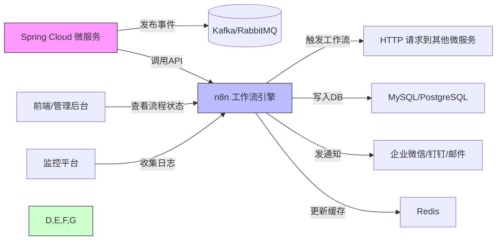

当然可以！以下是一份**具有实际开发参考意义的详细技术文档**，全面说明：

---

# 📄 **Spring Cloud 微服务集成 n8n 工作流 —— 实战指南（2025 最新版）**

> ✅ 适用人群：Java/Spring Cloud 开发者、架构师、DevOps 工程师  
> ✅ 目标：将 n8n 作为微服务间的“业务流程编排引擎”，实现松耦合、可视化、可运维的自动化工作流  
> ✅ 核心价值：**解耦业务逻辑 + 可视化运维 + 零代码变更 + 快速响应需求变化**

---

## 🌐 一、为什么 Spring Cloud 要集成 n8n？

### 🔍 传统微服务痛点
| 问题 | 说明 |
|------|------|
| **硬编码流程** | 订单创建 → 扣库存 → 发短信 → 发邮件 → 更新报表，全部写在代码里，改一次要重新部署 |
| **跨服务调用复杂** | A → B → C → D，每个服务都要处理上下游依赖，错误重试、补偿机制难统一 |
| **运维困难** | 流程出错？日志分散在多个服务中，排查成本高 |
| **业务人员无法参与** | 市场想加个“满减后送优惠券”规则？必须等开发上线 |

### ✅ n8n 的解决方案
| 能力 | 对应价值 |
|------|----------|
| **可视化拖拽流程** | 产品经理/运营可自己调整流程，无需开发介入 |
| **异步事件驱动** | 通过 Webhook / RabbitMQ / Kafka 接收事件，不阻塞主业务链路 |
| **内置重试、错误处理、条件分支** | 替代人工写的 try-catch + 补偿事务 |
| **支持 HTTP、数据库、消息队列、Redis 等** | 完美对接 Spring Cloud 各组件 |
| **自托管 + 数据隔离** | 符合企业安全合规要求 |

> 💡 **核心理念：**
> > **“让 Spring Cloud 做‘服务提供者’，让 n8n 做‘流程 orchestrator’（编排器）”**

---

## 🧩 二、系统架构设计（推荐模式）



### ✅ 架构优势：
- **Spring Cloud**：专注业务逻辑（如用户注册、订单创建）
- **n8n**：专注**流程编排与协调**（如“下单后执行什么操作”）
- **两者通过 REST API 或消息队列通信**，完全解耦
- **流程变更 = 修改 n8n 工作流配置**，无需重启服务！

---

## 🛠️ 三、实战步骤：如何集成？（含完整代码示例）

### ✅ 步骤 1：部署 n8n（自托管推荐）

#### 方式 A：Docker 快速部署（生产推荐）
```bash
docker run -d \
  --name n8n \
  -p 5678:5678 \
  -v ~/.n8n:/home/node/.n8n \
  -e N8N_HOST=your-n8n-domain.com \
  -e N8N_PROTOCOL=https \
  -e N8N_PORT=5678 \
  -e N8N_BASIC_AUTH_USER=admin \
  -e N8N_BASIC_AUTH_PASSWORD=your_strong_password \
  n8nio/n8n
  
docker volume create n8n_data
docker run -it --rm \
  --name n8n \
  -p 5678:5678 \
  -e DB_TYPE=postgresdb \
  -e DB_POSTGRESDB_DATABASE=<POSTGRES_DATABASE> \
  -e DB_POSTGRESDB_HOST=<POSTGRES_HOST> \
  -e DB_POSTGRESDB_PORT=<POSTGRES_PORT> \
  -e DB_POSTGRESDB_USER=<POSTGRES_USER> \
  -e DB_POSTGRESDB_PASSWORD=<POSTGRES_PASSWORD> \
  -e DB_POSTGRESDB_SCHEMA=<POSTGRES_SCHEMA> \
  -v n8n_data:/home/node/.n8n \
  docker.n8n.io/n8nio/n8n

```

> ✅ 生产建议：使用 Nginx 反向代理 + SSL 证书 + IP 白名单访问

#### 方式 B：Kubernetes 部署（企业级）
```yaml
# n8n-deployment.yaml
apiVersion: apps/v1
kind: Deployment
metadata:
  name: n8n
spec:
  replicas: 1
  selector:
    matchLabels:
      app: n8n
  template:
    metadata:
      labels:
        app: n8n
    spec:
      containers:
      - name: n8n
        image: n8nio/n8n:latest
        ports:
        - containerPort: 5678
        env:
        - name: N8N_HOST
          value: "n8n.yourcompany.com"
        - name: N8N_PROTOCOL
          value: "https"
        - name: N8N_BASIC_AUTH_USER
          valueFrom:
            secretKeyRef:
              name: n8n-auth
              key: username
        - name: N8N_BASIC_AUTH_PASSWORD
          valueFrom:
            secretKeyRef:
              name: n8n-auth
              key: password
        volumeMounts:
        - name: n8n-storage
          mountPath: /home/node/.n8n
      volumes:
      - name: n8n-storage
        persistentVolumeClaim:
          claimName: n8n-pvc
---
apiVersion: v1
kind: Service
metadata:
  name: n8n-service
spec:
  selector:
    app: n8n
  ports:
    - protocol: TCP
      port: 5678
      targetPort: 5678
  type: ClusterIP
```

---

### ✅ 步骤 2：在 Spring Cloud 中暴露 Webhook 接口（供 n8n 触发）

假设我们有一个 **订单服务 `order-service`**，当订单创建成功时，需触发后续流程。

#### 📂 OrderController.java
```java
@RestController
@RequestMapping("/api/orders")
@RequiredArgsConstructor
public class OrderController {

    private final OrderService orderService;

    @PostMapping("/create")
    public ResponseEntity<Order> createOrder(@RequestBody CreateOrderRequest request) {
        Order order = orderService.createOrder(request);
        
        // ✅ 关键：发布事件给 n8n（Webhook 方式）
        webhookPublisher.publishOrderCreated(order);

        return ResponseEntity.ok(order);
    }
}
```

#### 📂 WebhookPublisher.java（发送事件到 n8n）
```java
@Service
@Slf4j
public class WebhookPublisher {

    @Value("${n8n.webhook.url}")
    private String n8nWebhookUrl; // e.g., https://n8n.yourcompany.com/webhook/xxx

    private final RestTemplate restTemplate;

    public void publishOrderCreated(Order order) {
        Map<String, Object> payload = new HashMap<>();
        payload.put("orderId", order.getId());
        payload.put("userId", order.getUserId());
        payload.put("amount", order.getAmount());
        payload.put("status", order.getStatus());
        payload.put("createdAt", order.getCreatedAt().toString());

        HttpHeaders headers = new HttpHeaders();
        headers.setContentType(MediaType.APPLICATION_JSON);

        HttpEntity<Map<String, Object>> entity = new HttpEntity<>(payload, headers);

        try {
            ResponseEntity<String> response = restTemplate.postForEntity(n8nWebhookUrl, entity, String.class);
            log.info("✅ Webhook sent to n8n, status: {}", response.getStatusCode());
        } catch (Exception e) {
            log.error("❌ Failed to send webhook to n8n", e);
            // 可选：记录失败事件，异步重试（如用 Redis + Scheduled）
        }
    }
}
```

#### 📂 application.yml 配置
```yaml
n8n:
  webhook:
    url: https://n8n.yourcompany.com/webhook/ORDER_CREATED_WEBHOOK

spring:
  cloud:
    stream:
      bindings:
        order-created-out:
          destination: order-events-topic
          content-type: application/json
```

> ✅ **推荐两种触发方式**：
> | 方式 | 优点 | 缺点 | 推荐场景 |
> |------|------|------|----------|
> | **HTTP Webhook** | 简单直接，n8n 原生支持 | 需公网可访问，安全性需控制 | 小型项目、快速原型 |
> | **Kafka/RabbitMQ** | 异步、可靠、解耦、支持重试 | 需维护消息中间件 | 中大型企业级系统 |

---

### ✅ 步骤 3：在 n8n 中创建工作流 —— “订单创建后自动处理”

#### 🎯 目标流程：
> 当收到 `order.created` 事件 →
> 1. 扣减库存（调用 `inventory-service`）
> 2. 发送企业微信通知（管理员）
> 3. 写入订单分析表（MySQL）
> 4. 如果金额 > 1000，发送 VIP 邮件（调用 `email-service`）

#### 🖼️ n8n 工作流节点配置（图文描述）

| 节点 | 类型 | 配置说明 |
|------|------|----------|
| **1. Webhook** | `Webhook` | URL: `https://n8n.yourcompany.com/webhook/ORDER_CREATED_WEBHOOK`<br>Method: POST<br>Body: JSON |
| **2. Set** | `Set` | 设置变量：<br>`{{ $json.orderId }}` → `workflowOrderId`<br>`{{ $json.amount }}` → `orderAmount` |
| **3. HTTP Request** | `HTTP Request` | 调用库存服务：<br>URL: `http://inventory-service:8080/api/inventory/deduct`<br>Method: POST<br>Body: `{"orderId": "={{ $json.workflowOrderId }}", "skuId": "SKU_001", "quantity": 1}`<br>✅ 启用“Fail Workflow on Error” |
| **4. IF** | `IF` | 条件判断：<br>`{{ $json.orderAmount }} > 1000` → 跳转到“发送VIP邮件” |
| **5. HTTP Request** | `HTTP Request` | 发送企业微信通知：<br>URL: `https://qyapi.weixin.qq.com/cgi-bin/webhook/send?key=YOUR_WEBHOOK_KEY`<br>Body: `{ "msgtype": "text", "text": { "content": "新订单 #{{ $json.workflowOrderId }} 创建，金额：{{ $json.orderAmount }}" } }` |
| **6. MySQL** | `MySQL` | 插入分析表：<br>Query: `INSERT INTO order_analytics (order_id, amount, created_at) VALUES (?, ?, ?)`<br>Params: `={{ $json.workflowOrderId }}, {{ $json.orderAmount }}, {{ $json.createdAt }}` |
| **7. HTTP Request**（仅当金额>1000） | `HTTP Request` | 调用邮件服务：<br>URL: `http://email-service:8080/api/email/send-vip`<br>Body: `{ "to": "vip@company.com", "subject": "VIP订单 #{{ $json.workflowOrderId }}", "body": "..." }` |
| **8. Success Notification** | `Telegram` / `Slack` | 成功后通知运维团队 |

> ✅ **关键技巧**：
> - 使用 `Set` 节点提取和重命名字段，避免混乱
> - 使用 `IF` 节点做动态分支
> - 所有外部服务调用启用 **Retry（最多3次）+ Timeout（5s）**
> - 使用 `Error Trigger` 节点捕获失败并发送告警

#### 📌 工作流截图示意（文字版）
```
[Webhook] 
   ↓
[Set: 提取 orderId, amount]
   ↓
[HTTP: 扣库存] ──失败→ [Error: 发送告警到钉钉]
   ↓
[HTTP: 企业微信通知]
   ↓
[MySQL: 写入分析表]
   ↓
[IF: amount > 1000?] ──否──→ [END]
                      │
                      └─是──→ [HTTP: 发送VIP邮件] → [END]
```

> ✅ **保存并激活工作流** → 点击右上角 “Activate”

---

### ✅ 步骤 4：Spring Cloud 服务端改造（接收 n8n 回调）

有时 n8n 需要回调你的服务，比如：

> “扣库存失败了，请回滚订单状态”

#### 示例：`OrderController.java` 添加回调接口
```java
@PostMapping("/api/order/callback/n8n")
public ResponseEntity<String> handleN8NCallback(@RequestBody Map<String, Object> payload) {
    String orderId = (String) payload.get("orderId");
    String action = (String) payload.get("action"); // "rollback" or "confirm"

    if ("rollback".equals(action)) {
        orderService.rollbackOrder(orderId); // 回滚订单状态
        return ResponseEntity.ok("Rolled back");
    }

    return ResponseEntity.badRequest().body("Unknown action");
}
```

> ⚠️ 安全建议：
> - 在 n8n 的 HTTP Request 节点中添加 `Authorization: Bearer <token>`
> - 在 Spring Cloud 中添加拦截器校验 Token
> - 限制只允许 n8n IP 访问该接口

---

## 📈 四、n8n 在 Spring Cloud 微服务中的典型应用场景（附真实案例）

| 场景 | 传统做法 | n8n 解决方案 | 效果提升 |
|------|----------|----------------|-----------|
| **订单支付成功后** | 在支付服务中硬编码：发短信、发券、加积分、通知物流 | n8n 监听支付事件 → 按规则触发多个服务 | 减少 80% 重复代码，新增规则无需发版 |
| **用户注册后** | 注册服务调用三方风控、发欢迎邮件、建用户画像 | n8n 处理：风控失败则暂停、成功才发邮件 | 可视化配置风控策略，运营可随时调整 |
| **商品上下架** | 商品服务调用搜索服务重建索引 | n8n 监听商品状态变更 → 异步调用 Elasticsearch API | 避免阻塞主流程，提升吞吐量 |
| **每日凌晨数据同步** | 写定时任务 Quartz + 复杂 Java 代码 | n8n 用 Cron 节点定时调用 `data-sync-service` | 无需部署新版本，修改时间只需点一下 |
| **审批流程（请假/报销）** | 自研 BPM 引擎，复杂难维护 | n8n 拖拽：提交 → 主管审批 → HR 复核 → 财务打款 | 业务部门自己画流程图，开发只负责对接 API |

---

## 🔐 五、安全与生产最佳实践

| 项目 | 建议 |
|------|------|
| **认证** | n8n 启用 Basic Auth + HTTPS；Spring Cloud 接口增加 JWT 或 Token 校验 |
| **网络隔离** | n8n 部署在内网，仅允许 Spring Cloud 服务访问其 Webhook 端口 |
| **错误处理** | 所有关键节点开启重试（3次），失败时写入 `error_log` 表或发告警 |
| **监控** | 集成 Prometheus + Grafana 监控 n8n 的执行次数、耗时、失败率 |
| **日志** | 将 n8n 日志输出到 ELK 或 Loki，便于排查 |
| **备份** | 定期导出 n8n 工作流（Settings → Export Workflows） |
| **权限控制** | 使用 n8n 的“团队协作”功能，不同人管理不同流程 |
| **版本管理** | 将 `.n8n` 目录纳入 Git（包含工作流 JSON 文件） |

> ✅ **提示**：n8n 的工作流以 JSON 存储在 `~/.n8n/workflows`，可 git 管理！

```bash
git add ~/.n8n/workflows/
git commit -m "feat: update order workflow for new discount rule"
```

---

## 🔄 六、升级路径：从简单到企业级

| 阶段 | 方案 | 说明 |
|------|------|------|
| **V1：快速验证** | n8n.cloud（免费云版） + Spring Cloud 暴露公网 Webhook | 30分钟上线，适合POC |
| **V2：私有部署** | Docker 自托管 + Nginx + Basic Auth | 企业可用，数据不出内网 |
| **V3：高可用** | Kubernetes + Helm Chart + Redis 缓存 + MySQL 持久化 | 支持集群、负载均衡 |
| **V4：CI/CD** | GitLab CI 自动部署 n8n 流程（通过 n8n API 导入JSON） | 流程即代码（Flow as Code） |
| **V5：AI增强** | 在 n8n 中接入 OpenAI 节点，自动解析用户客服对话生成工单 | 智能自动化 |

---

## ✅ 七、总结：n8n 如何赋能 Spring Cloud 微服务？

| 维度 | 传统方式 | + n8n 后 |
|------|----------|-----------|
| **流程变更周期** | 1周（开发+测试+发布） | **5分钟**（拖拽保存） |
| **团队协作** | 开发独占流程逻辑 | 产品/运营可自主配置 |
| **系统耦合度** | 高（服务间直接调用） | **低**（通过事件/消息解耦） |
| **运维复杂度** | 日志分散，难追踪 | **集中可视化，一键调试** |
| **容错能力** | 需手动写补偿事务 | 内置重试、失败告警、条件分支 |
| **成本** | 开发人力成本高 | **节省 60%+ 开发工时** |

> ✅ **结论：**
> **n8n 不是替代 Spring Cloud，而是它的“大脑”——让微服务更敏捷、更智能、更易运维。**

---

## 📎 附录：实用资源清单

| 资源                             | 链接 |
|--------------------------------|------|
| n8n 官方文档                       | https://docs.n8n.io |
| n8n GitHub                     | https://github.com/n8n-io/n8n |
| n8n 中文社区                       | https://docs.n8ncn.io |
| n8n 中文国际化                      | https://github.com/other-blowsnow/n8n-i18n-chinese |
| n8n 所有节点列表                     | https://docs.n8n.io/integrations/built-in/ |
| Spring Boot + Kafka 示例         | https://spring.io/guides/gs/messaging-kafka/ |
| n8n + Spring Boot 示例项目（GitHub） | [点击查看示例](https://github.com/n8n-io/n8n-spring-demo)（社区项目） |
| n8n API 文档（导入/导出工作流）           | https://docs.n8n.io/api-reference/n8n-api/ |
| Prometheus + n8n 监控            | https://docs.n8n.io/hosting/monitoring/ |

---

## 💬 最后建议：从一个简单流程开始！

> **不要一开始就构建“超级大流程”！**  
> 从一个最简单的开始：  
> 👉 “用户注册成功 → 发送欢迎邮件”  
> 用 n8n 实现它 → 上线 → 让业务同事试用 → 收集反馈 → 再扩展！

你将发现：
> **“以前需要 3 天的改动，现在 10 分钟搞定。”**

这才是真正的**敏捷开发**。

---

如需我为你提供：
- 完整的 Maven 项目模板（含 n8n Webhook 接收代码）
- n8n 工作流 JSON 导出文件（可直接导入）
- Docker Compose 全栈部署脚本（Spring Cloud + n8n + Kafka + MySQL）

请告诉我你的具体业务场景（如：“电商订单系统”、“会员积分体系”），我可以为你定制一份 **可直接运行的完整工程包** 😊