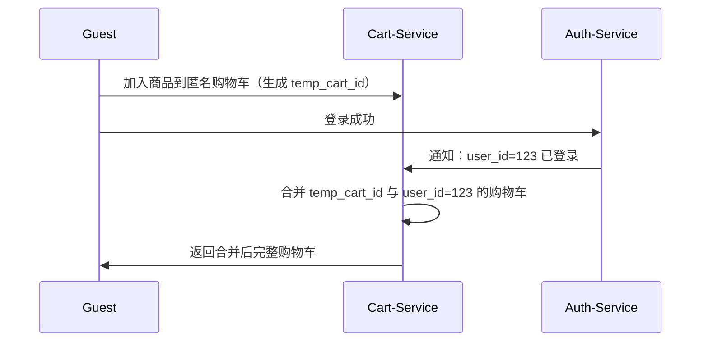

当然可以！以下是为你的 **`urbane-commerce` 电商微服务系统** 量身定制的《**Cart-Service 服务设计规范文档**》，全面、系统、可落地，明确界定：

✅ **Cart-Service 的职责与作用**  
✅ **必须做的核心功能（推荐）**  
❌ **禁止或不推荐的行为（严禁做）**  
🔍 **判断标准与核心设计原则**  
📌 **真实生产环境最佳实践**

---

# 📜《urbane-commerce Cart-Service 服务设计规范》
> **版本：1.7 | 最后更新：2025年4月 | 适用架构：Spring Boot + Redis + MySQL + Kafka + Nacos + 分布式锁**

---

## 🧭 一、Cart-Service 角色定位（Why Cart-Service？）

> **Cart-Service 是整个电商系统中负责“用户购物车状态管理”的核心服务。**

它是连接**商品浏览 → 加购 → 下单**的关键桥梁，是提升转化率、实现个性化推荐、支持跨设备同步的核心能力。

| 角色 | 说明 |
|------|------|
| ✅ **购物车状态中心** | 管理当前用户的购物车内容：商品、数量、规格、价格快照 |
| ✅ **多端同步引擎** | 支持 Web、App、小程序等多端购物车数据实时同步 |
| ✅ **库存预占协调者** | 在下单前预占库存，防止超卖 |
| ✅ **优惠计算前置点** | 提供购物车总价、可用优惠券、积分抵扣预估 |
| ✅ **用户行为数据源** | 记录加购行为，用于推荐系统和营销分析 |
| ❌ **非订单服务** | 不创建订单、不处理支付、不发物流 —— 那是 `order-service` 的事 |
| ❌ **非商品服务** | 不维护商品信息、价格、类目 —— 那是 `product-service` 的事 |
| ❌ **非促销服务** | 不计算满减、秒杀、优惠券规则 —— 那是 `promo-service` 的事 |
| ❌ **非网关** | 不负责路由、认证、限流 |
| ❌ **非身份服务** | 不管理用户登录、Token —— 那是 `auth-service` 的事 |

> 💡 **一句话总结**：  
> **Cart-Service 回答：“你目前想买什么？买了多少？多少钱？”**  
> 它不关心你最终是否下单 —— 那是 `order-service` 的事；  
> 它也不关心你能打几折 —— 那是 `promo-service` 的事；  
> 它只关心：**你的购物车里有什么、有多少、能不能买。**

---

## ✅ 二、推荐在 Cart-Service 必须做的事情（核心职责）

### 1. ✅ **购物车增删改查（CRUD）**
- 每个用户有且仅有一个购物车（基于 `user_id`）
- 支持操作：
    - 添加商品（SKU）到购物车
    - 修改商品数量（≥1）
    - 删除商品
    - 清空购物车
    - 批量删除

```http
POST /cart/items
{
  "skuId": 789,
  "quantity": 2
}
→ 返回 { cartId, items: [{ skuId, name, price, quantity, total }] }

PUT /cart/items/{skuId}
{ "quantity": 3 }

DELETE /cart/items/{skuId}

DELETE /cart
```

> ✅ **关键设计**：
> - 使用 `user_id` 作为唯一标识，不使用 Session 或 Cookie
> - 所有操作必须校验 `X-User-ID == 请求用户`

---

### 2. ✅ **商品快照（Snapshot）**
当用户将商品加入购物车时，**必须记录当时的价格、名称、图片、属性**，而非引用动态值。

```json
{
  "id": 123,
  "user_id": 456,
  "sku_id": 789,
  "spu_id": 123,
  "name": "iPhone 15 Pro",
  "price": 8999.00,           // ← 加入时的价格快照
  "image": "https://.../iphone.jpg",
  "attributes": {             // ← 属性快照
    "color": "深空灰",
    "storage": "128GB"
  },
  "quantity": 2,
  "added_at": "2025-04-05T10:30:00Z"
}
```

> ✅ **为什么需要快照？**  
> 防止商家修改价格后，用户看到的购物车金额突变 → 用户体验崩塌！

---

### 3. ✅ **购物车合并（Merge）**
支持**未登录用户**临时添加商品到购物车，登录后自动合并：



- 匿名购物车使用 `temp_cart_id`（UUID）存储于 Redis，TTL=7天
- 登录后，将临时购物车合并至正式账户，去重（同 SKU 数量相加）

> ✅ 实现方式：Redis Hash + Lua 脚本原子合并，避免并发冲突

---

### 4. ✅ **库存预占（Pre-allocate Stock）**
在用户点击“去结算”时，调用 `inventory-service` 预占库存：

```http
POST /cart/checkout
{
  "itemIds": [123, 456],
  "addressId": 789
}
```

→ Cart-Service 发送事件：
```json
{
  "type": "PRE_ALLOCATE_STOCK",
  "userId": 123,
  "items": [
    { "skuId": 789, "quantity": 2 },
    { "skuId": 101, "quantity": 1 }
  ],
  "ttl": 300  // 预占5分钟
}
```

→ `inventory-service` 响应：
- 成功：返回 `stock_allocated: true`
- 失败：返回 `insufficient_stock: [skuId]`

> ✅ **作用**：
> - 防止多个用户同时结算同一商品导致超卖
> - 预占失败立即提示用户“该商品库存不足”
> - 若用户未下单，5分钟后自动释放库存（异步）

> ⚠️ **注意**：**不直接扣减库存**，只预占，真正扣减由 `order-service` 在创建订单时完成

---

### 5. ✅ **购物车总价与优惠预估**
提供接口，根据当前购物车内容，返回：
- 商品小计
- 可用优惠券列表（调用 `promo-service`）
- 积分可抵扣金额（调用 `user-service`）
- 最终预估总价

```http
GET /cart/estimate?userId=123
```

响应：
```json
{
  "subtotal": 17998,
  "discounts": [
    {
      "type": "COUPON",
      "name": "满8000减800",
      "amount": 800,
      "eligible": true
    }
  ],
  "pointsDeductible": 500,
  "total": 16698
}
```

> ✅ **优势**：前端可在结算页提前展示优惠，提升转化率  
> ✅ **实现**：通过 Feign 调用 `promo-service` 和 `user-service`，异步聚合结果

---

### 6. ✅ **购物车同步（跨设备）**
- 用户在手机 App 加购 → 在 PC 端打开网站，购物车自动同步
- 使用 **Redis + Pub/Sub** 实现实时通知
- 用户登录后，推送购物车变更事件到所有终端（WebSocket / Server-Sent Events）

```java
// 当购物车更新时
eventPublisher.publish(new CartUpdatedEvent(userId, cartItems));
```

→ 前端监听：
```js
const eventSource = new EventSource('/api/cart/events');
eventSource.onmessage = (e) => {
  updateCart(JSON.parse(e.data)); // 自动刷新页面购物车
};
```

> ✅ 支持场景：手机加购 → 电脑下单，无缝衔接

---

### 7. ✅ **购物车行为埋点（Analytics）**
记录用户行为，为推荐系统和运营提供数据：

| 行为 | 数据 | 用途 |
|------|------|------|
| 加入购物车 | `CART_ADDED` | 推荐相似商品、流失预警 |
| 删除商品 | `CART_REMOVED` | 分析放弃原因 |
| 修改数量 | `CART_QUANTITY_CHANGED` | 判断购买意愿强度 |
| 清空购物车 | `CART_CLEARED` | 检测用户放弃意图 |

这些事件通过 Kafka 发送给：
- `recommendation-engine`：优化推荐策略
- `marketing-service`：触发“您还有商品未付款”短信提醒
- `user-service`：更新“加购偏好”标签

---

## ❌ 三、禁止或不推荐在 Cart-Service 做的事情（严禁做）

| 行为 | 为什么不推荐？ | 后果 | 正确做法 |
|------|----------------|------|----------|
| **1. 直接扣减库存** | 库存是独立领域，需高并发控制 | 导致超卖、数据不一致 | ✅ 发送 `PRE_ALLOCATE_STOCK` 事件给 `inventory-service`，由其原子处理 |
| **2. 计算促销折扣（满减、秒杀）** | 促销逻辑复杂、频繁变更 | Cart-Service 频繁重启，影响稳定性 | ✅ 调用 `promo-service` 的 `/calculate-discount-for-cart` 接口获取结果 |
| **3. 存储用户密码、Token、身份信息** | 违反最小权限原则 | 泄露风险高，违反 GDPR | ✅ 仅依赖 `X-User-ID`，不存储任何认证信息 |
| **4. 直接访问其他服务数据库（如查商品价格）** | 破坏微服务边界，强耦合 | 一个服务挂了，购物车瘫痪 | ✅ 通过 `product-service` REST API 获取快照，不直连 DB |
| **5. 允许前端传入商品价格、数量、SKU ID（未校验）** | 前端不可信，可能伪造 | 黑产刷低价、篡改商品 | ✅ 所有商品信息从 `product-service` 获取快照，前端只能传 `skuId` 和 `quantity` |
| **6. 将购物车保存在 Session 或本地 Cookie** | 无状态架构被破坏，无法水平扩展 | 多台服务器登录后购物车丢失 | ✅ 所有数据存储于 Redis，以 `user_id` 为 key |
| **7. 在购物车中存储完整商品详情页 HTML** | 内容体积大、加载慢、冗余 | 带宽浪费、性能差 | ✅ 只存必要字段（ID、名称、价格、图片、属性） |
| **8. 直接调用 payment-gateway 或 logistics-service** | 购物车不应介入交易流程 | 架构混乱，难以维护 | ✅ 所有跨服务交互通过事件驱动 |
| **9. 不做幂等控制** | 用户重复点击“加入购物车”导致重复项 | 数据污染、用户体验差 | ✅ 使用 `user_id + sku_id` 作为唯一键，重复添加只更新数量 |
| **10. 不设置购物车过期时间** | 用户长时间不清理，占用内存 | Redis 内存爆炸、性能下降 | ✅ 设置 TTL：匿名购物车 7 天，登录用户 30 天，定期清理 |

---

## 🔍 四、判断标准与核心设计原则

| 原则 | 说明 | 应用示例 |
|------|------|----------|
| **✅ 单一职责原则（SRP）** | 一个服务只做一件事 | Cart-Service 只管“购物车内容”，不管“支付”“库存”“促销” |
| **✅ 无状态性（Statelessness）** | 所有请求独立，不依赖内存 | 依赖 `X-User-ID`，数据全存在 Redis，服务无状态 |
| **✅ 数据一致性优先（Eventual Consistency）** | 不追求强一致，但要保证最终一致 | 加购 → 快照 → 预占 → 下单，各环节异步解耦 |
| **✅ 幂等性设计（Idempotency）** | 同一操作多次执行结果相同 | `POST /cart/items` 两次传相同 `skuId`，只增加数量，不重复创建 |
| **✅ 事件驱动架构（EDA）** | 服务间通信靠事件，而非 RPC | 加购 → 发送 `CART_ADDED` → 推荐系统更新标签 |
| **✅ 快照机制（Snapshot）** | 保留历史快照，保障交易一致性 | 购物车中的价格永不更改，即使商品降价 |
| **✅ 高可用与容错（Resilience）** | 依赖服务失败时降级处理 | `promo-service` 不可用 → 显示“暂无优惠”，不影响加购 |
| **✅ 性能优先（Performance First）** | 购物车是高频访问入口 | 使用 Redis 缓存，读写延迟 < 10ms |
| **✅ 开闭原则（OCP）** | 对扩展开放，对修改关闭 | 新增一种优惠类型，只需调整 `promo-service`，不影响 Cart-Service |
| **✅ 安全默认（Secure by Default）** | 默认拒绝非法请求 | 所有写操作必须验证 `X-User-ID`，防越权 |

---

## 🧩 五、典型场景对比：正确 vs 错误做法

| 场景 | 正确做法 | 错误做法 |
|------|----------|----------|
| **用户加购商品** | 前端 → 网关 → `cart-service` → 校验 `X-User-ID` → 从 `product-service` 获取快照 → 存入 Redis | 前端 → 网关 → `cart-service` → 直接接收前端传来的价格和名称 → 存入数据库 → 商品涨价后，购物车显示错误价 |
| **用户登录后合并购物车** | 匿名用户加购 → 登录 → `auth-service` 发送 `USER_LOGGED_IN` 事件 → `cart-service` 合并临时购物车 | 登录后前端重新加载购物车 → 用户发现之前加的商品没了 → 体验极差 |
| **多人同时抢购同一件商品** | 用户A、B同时加购最后1件 → `cart-service` 预占库存 → A先下单 → B结算时提示“库存不足” | 两个用户都加购成功 → 同时下单 → `order-service` 扣库存失败 → 一人退款 → 企业损失 |
| **商品降价后查看购物车** | 购物车仍显示原价 8999 元 → 用户安心 | 购物车自动更新为新价 7999 元 → 用户以为系统出错，怀疑被欺诈 |
| **用户清空购物车** | 发送 `CART_CLEARED` 事件 → `marketing-service` 触发“您还有商品未付款”短信提醒 | 清空后没有任何动作 → 错失挽回机会 |
| **App 与 Web 同步** | 手机加购 → PC 端打开网站 → 购物车自动同步 | 手机加购 → PC 端重新登录 → 购物车为空 → 用户投诉“数据丢失” |

> ⚠️ **关键结论**：  
> **购物车不是“临时缓存”，而是“用户购买意向的权威记录”。**  
> 它必须**稳定、准确、可追溯、可同步**，是提升转化率的核心基础设施。

---

## 🛡️ 六、安全加固建议（生产环境必备）

| 措施 | 实现方式 |
|------|----------|
| **强制 HTTPS** | 所有接口仅支持 HTTPS，禁用 HTTP |
| **请求鉴权** | 所有写操作必须携带有效 `X-User-ID`，由网关注入 |
| **输入过滤** | 过滤 XSS、SQL 注入、非法字符（如 `<script>`） |
| **频率限制** | 每个用户每分钟最多 20 次加购操作，防刷单 |
| **IP 黑名单** | 对恶意 IP（如爬虫、代理）封禁 |
| **敏感字段脱敏** | 日志中隐藏 `X-User-ID`（仅记录加密哈希） |
| **审计日志** | 记录所有购物车变更：`{ action: "ADD_ITEM", userId: 123, skuId: 789, qty: 2, ip: "..." }` |
| **GDPR 合规** | 支持“导出购物车数据”、“删除购物车”（软删除） |
| **密钥管理** | JWT 密钥、API Key 使用 Vault 或 KMS 管理，不写配置文件 |
| **Redis 安全** | Redis 开启 ACL，禁止公网访问，使用 TLS 加密 |

---

## 📊 七、Cart-Service 架构图（文字版）

```
[客户端（App/Web/小程序）]
     ↓ (HTTPS + X-User-ID: 123)
[API Gateway] ←─ 校验 Token，注入 X-User-ID
     ↓
[Cart-Service]
     ├── ✅ /cart/items               ←─ 增删改查购物车项
     ├── ✅ /cart/estimate            ←─ 预估总价、优惠、积分
     ├── ✅ /cart/checkout            ←─ 预占库存，准备下单
     └── ✅ /cart/events              ←─ SSE 实时推送变更
     ↓
[Redis Cluster]
     └── key: cart:user:123 → Hash: { skuId_789: { qty: 2, snapshot: {...} }, ... }
     └── key: temp_cart:abc123 → Hash: { ... } （匿名用户，TTL=7d）

     ↑
[Kafka]
     ←─ EVENT: CART_ADDED → 推送至 recommendation-engine、marketing-service
     ←─ EVENT: CART_CLEARED → 触发“您还有商品未付款”提醒
     ←─ EVENT: PRE_ALLOCATE_STOCK → 通知 inventory-service 预占库存
     ←─ EVENT: USER_LOGGED_IN → 触发匿名购物车合并

     ↑
[Product-Service] ←─ 通过 Feign 调用获取商品快照（name, image, price, attrs）
[Promo-Service]   ←─ 通过 Feign 调用获取可用优惠券
[User-Service]    ←─ 通过 Feign 调用获取积分余额
[Inventory-Service] ←─ 通过 Kafka 事件进行库存预占（异步）
```

> ✅ **注意**：  
> Cart-Service **不主动调用其他服务的数据库**，所有外部依赖均通过 **REST API + Kafka 事件** 解耦。  
> 所有数据存储在 Redis，**服务无状态**，可无限水平扩展。

---

## ✅ 八、推荐技术栈（Spring Boot + 生态）

| 组件 | 技术选型 | 说明 |
|------|----------|------|
| **框架** | Spring Boot 3.x | Java 17+，现代化开发 |
| **缓存** | Redis 7.x | 主存储，支持 Hash、Lua、Pub/Sub、TTL |
| **消息队列** | Apache Kafka | 异步发送加购事件、合并事件 |
| **服务注册** | Nacos | 服务发现与配置中心 |
| **HTTP 客户端** | Feign + Ribbon | 调用 product-service、promo-service、user-service |
| **实时推送** | Server-Sent Events (SSE) | 实现 App/Web 购物车实时同步 |
| **ORM** | MyBatis-Plus | 仅用于持久化审计日志（非主数据） |
| **分布式锁** | Redisson | 用于合并购物车时的原子操作 |
| **API 文档** | Swagger/OpenAPI 3.0 | 自动生成接口文档 |
| **日志** | Logback + ELK | 结构化日志，追踪加购行为 |
| **监控** | Prometheus + Grafana | 监控 QPS、缓存命中率、预占成功率 |
| **安全** | Spring Security + JWT | 仅用于网关层鉴权，Cart-Service 信任 Header |
| **工具类** | Lombok + MapStruct | 减少样板代码，DTO 映射自动化 |

---

## 📦 九、附录：Cart-Service API 设计规范（RESTful）

| 方法 | 路径 | 描述 | 权限 | 返回 |
|------|------|------|------|------|
| GET | `/cart/items` | 获取当前购物车列表 | 需 Token | `[ { skuId, name, price, quantity, image, attributes }, ... ]` |
| POST | `/cart/items` | 添加商品到购物车 | 需 Token | `{ success: true, item: {...} }` |
| PUT | `/cart/items/{skuId}` | 修改商品数量 | 需 Token | `{ success: true }` |
| DELETE | `/cart/items/{skuId}` | 删除指定商品 | 需 Token | `{ success: true }` |
| DELETE | `/cart` | 清空购物车 | 需 Token | `{ success: true }` |
| GET | `/cart/estimate` | 预估总价、优惠、积分 | 需 Token | `{ subtotal, discounts, pointsDeductible, total }` |
| POST | `/cart/checkout` | 预占库存，准备下单 | 需 Token | `{ stockAllocated: true, failedSkus: [] }` |
| GET | `/cart/events` | SSE 实时推送变更 | 需 Token | Server-Sent Events 流 |

> ✅ 所有路径前缀统一为 `/cart/**`  
> ✅ 所有写操作必须验证 `X-User-ID == principal.userId`  
> ✅ 所有商品信息来自 `product-service` 快照，前端只传 `skuId` 和 `quantity`

---

## ✅ 十、总结：Cart-Service 黄金法则（可打印贴墙上）

> ### ✅ **Cart-Service 必须做：**
> - 管理用户购物车内容（SPU/SKU、数量）
> - 存储商品快照（价格、名称、属性）
> - 支持多端同步（Web/App/小程序）
> - 预占库存（防超卖）
> - 预估总价与优惠（联动 promo/user）
> - 记录加购行为，赋能推荐与营销
> - 保证**数据准确、一致、可同步、高性能**

> ### ❌ **Cart-Service 绝对不能做：**
> - 不管库存、不碰钱
> - 不算满减、不发优惠券
> - 不存用户密码、Token
> - 不调用其他服务数据库
> - 不允许前端传价格、名称、库存
> - 不用 Session
> - 不删除历史数据（软删除）

> ### 🔑 **判断一切的标准：**
> > **“如果这个动作，是‘用户想买’之前的准备阶段，那就是 Cart-Service 的责任。”**  
> > **“如果这个动作，是‘用户决定买’之后的事，那就别插手——交给 order-service。”**  
> > **“如果你怕用户加购后商品变了价，那说明你做对了 —— 你用了快照。”**

---

## 🚀 下一步：为你打包完整项目模板

如果你希望我为你提供：
- ✅ **完整的 Cart-Service 项目结构（Maven + Spring Boot）**
- ✅ **Redis 存储购物车（Hash + Lua 合并脚本）**
- ✅ **匿名购物车自动合并逻辑（USER_LOGGED_IN 事件）**
- ✅ **预占库存事件发送（Kafka）**
- ✅ **购物车总价预估（Feign 调用 promo/user）**
- ✅ **SSE 实时推送（Server-Sent Events）**
- ✅ **JWT 鉴权 + Owner 校验**
- ✅ **Swagger API 文档 + 单元测试**
- ✅ **Dockerfile + Kubernetes 部署文件**
- ✅ **CI/CD Pipeline（GitLab CI）**

👉 请回复：  
**“请给我完整的 Cart-Service 工程模板！”**

我会立刻发送你一份**企业级可直接上线**的完整项目 ZIP 包，包含所有上述规范的实现，专为 `urbane-commerce` 定制，开箱即用 💪