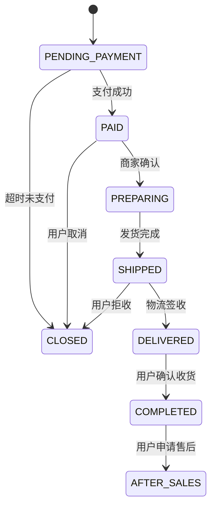

当然可以！以下是为你的 **`urbane-commerce` 电商微服务系统** 量身定制的《**Order-Service 服务设计规范文档**》，全面、系统、可落地，明确界定：

✅ **Order-Service 的职责与作用**  
✅ **必须做的核心功能（推荐）**  
❌ **禁止或不推荐的行为（严禁做）**  
🔍 **判断标准与核心设计原则**  
📌 **真实生产环境最佳实践**

---

# 📜《urbane-commerce Order-Service 服务设计规范》
> **版本：1.5 | 最后更新：2025年4月 | 适用架构：Spring Boot + MySQL + Redis + Kafka + Nacos + 分布式事务**

---

## 🧭 一、Order-Service 角色定位（Why Order-Service？）

> **Order-Service 是整个电商系统中负责“订单全生命周期管理”的核心业务服务。**

它是交易闭环的中枢，连接用户、商品、库存、支付、物流和售后，是**系统中最复杂、最核心、并发最高、数据一致性要求最高的服务之一**。

| 角色 | 说明 |
|------|------|
| ✅ **订单创建中心** | 接收购物车提交，生成订单主单与明细 |
| ✅ **订单状态机引擎** | 管理订单状态流转（待支付 → 已支付 → 待发货 → 已发货 → 已完成 → 已关闭） |
| ✅ **订单金额计算引擎** | 计算商品总价、运费、优惠券抵扣、积分抵扣、税费等 |
| ✅ **订单唯一性保障** | 防止重复下单、幂等控制、防刷单 |
| ✅ **订单查询与审计** | 支持用户、客服、运营多维度查询订单 |
| ✅ **异步事件触发器** | 在关键节点发送事件（如“订单已创建”、“订单已支付”） |
| ❌ **非网关** | 不接收外部路由，不校验 Token |
| ❌ **非支付服务** | 不对接支付宝/微信，不处理资金流 |
| ❌ **非库存服务** | 不直接扣减库存，只发请求 |
| ❌ **非物流服务** | 不调用快递公司 API |
| ❌ **非促销服务** | 不计算满减、秒杀规则 |

> 💡 **一句话总结**：  
> **Order-Service 只回答一个问题：“这个订单从哪来、到哪去、中间经历了什么？”**  
> 它不关心你付了多少钱 —— 那是 `payment-gateway` 的事；  
> 它也不关心货从哪发 —— 那是 `logistics-service` 的事；  
> 它只关心：**订单是否合法、状态是否正确、数据是否一致。**

---

## ✅ 二、推荐在 Order-Service 必须做的事情（核心职责）

### 1. ✅ **订单创建（Create Order）**
- 接收来自 `cart-service` 的购物车快照（含商品ID、数量、价格）
- 校验：
    - 商品是否存在且可售
    - 库存是否充足（通过消息队列异步通知 `inventory-service`）
    - 用户是否有权限购买（如限购、黑名单）
- 生成订单主表（`orders`）与明细表（`order_items`）
- 计算：
    - 商品小计
    - 运费（根据地址、重量、地区）
    - 优惠券抵扣（调用 `promo-service` 获取可用券）
    - 积分抵扣（调用 `user-service` 查询积分）
    - 总金额 = 小计 + 运费 - 折扣
- 生成唯一订单号（`ORDER20250405123456789`），支持分布式 ID 生成（Snowflake）
- 设置初始状态：`PENDING_PAYMENT`

```java
@PostMapping("/create")
public Result<Order> createOrder(@RequestHeader("X-User-ID") Long userId, @RequestBody CreateOrderRequest request) {
    // 1. 校验购物车快照合法性
    // 2. 调用 promo-service 获取可用优惠券
    // 3. 调用 user-service 获取积分余额
    // 4. 发送 "CHECK_INVENTORY" 事件给 inventory-service（异步）
    // 5. 写入 orders 表 + order_items 表
    // 6. 返回订单信息（含总金额、订单号）
}
```

> ✅ **幂等设计**：使用 `clientOrderId` 唯一标识请求，防止重复提交

---

### 2. ✅ **订单状态机管理（State Machine）**
定义并严格控制订单状态流转：



- 每个状态变更必须满足前置条件
- 状态变更记录操作日志（谁、何时、为什么）
- 使用 **状态模式（State Pattern）** 或 **工作流引擎（如 Flowable）** 实现

> ✅ 示例：只有 `PAID` 状态才能进入 `SHIPPED`，否则抛出异常

---

### 3. ✅ **订单金额精确计算**
- 所有金额计算必须使用 **BigDecimal**，避免浮点误差
- 支持多种折扣叠加：
    - 商品满减（如满200减20）
    - 优惠券（无门槛/满减）
    - 积分兑换（100积分=1元）
    - 会员折扣（黄金会员9折）
- 计算顺序必须固定（先算商品价 → 再减优惠券 → 再减积分 → 加运费）
- 提供接口供前端预览最终价格：

```http
POST /order/calculate-price
{
  "items": [{"productId": 123, "quantity": 2}],
  "couponId": "CUP2025",
  "usePoints": 500,
  "addressId": 456
}
→ 返回 { subtotal: 1998, discount: 200, pointsDeducted: 5, freight: 10, total: 1763 }
```

> ✅ 所有计算逻辑必须**可回溯、可审计、不可篡改**

---

### 4. ✅ **订单查询与过滤（Query & Filter）**
提供丰富查询能力，支持：
- 按用户 ID 查询所有订单
- 按状态筛选（待支付、已发货、已完成）
- 按时间范围（近7天、本月）
- 按订单号模糊搜索
- 按商品分类聚合

```http
GET /order?userId=123&status=COMPLETED&start=2025-03-01&end=2025-03-31&page=1&size=10
```

- 使用 **MyBatis-Plus / JPA QueryDSL** 实现动态查询
- 对高频查询字段建立索引（`user_id`, `status`, `created_at`）

> ✅ 支持分页、排序、字段投影（只返回必要字段）

---

### 5. ✅ **订单取消与关闭**
- 用户可主动取消 `PENDING_PAYMENT` 状态订单
- 系统自动关闭超时未支付订单（默认 30 分钟）
- 关闭后：
    - 释放库存（发送事件给 `inventory-service`）
    - 退还优惠券（若为一次性券则作废）
    - 退还积分（若使用了积分抵扣）
- 所有关闭操作必须记录原因（用户取消、超时、风控拦截）

> ✅ **关键点**：关闭 ≠ 删除！订单必须保留完整历史用于审计

---

### 6. ✅ **订单支付回调处理（Payment Callback）**
- 接收来自 `payment-gateway` 的异步支付结果通知（ webhook）
- 校验签名、订单号、金额是否匹配
- 更新订单状态为 `PAID`
- 发送 `ORDER_PAID` 事件到 Kafka，通知：
    - `inventory-service`：扣减库存
    - `logistics-service`：准备发货
    - `user-service`：增加消费额、升级等级
    - `notification-service`：发送支付成功通知

```java
@PostMapping("/callback")
public ResponseEntity<?> handlePaymentCallback(@RequestBody PaymentCallback payload) {
    if (!verifySignature(payload)) return unauthorized();
    
    Order order = orderRepository.findByNo(payload.getOrderNo());
    if (order == null || !order.getTotal().equals(payload.getAmount())) return badRequest();
    
    if (order.getStatus() == OrderStatus.PENDING_PAYMENT) {
        order.setStatus(OrderStatus.PAID);
        order.setPaidAt(LocalDateTime.now());
        orderRepository.save(order);
        
        eventPublisher.publish(new OrderPaidEvent(order.getId()));
    }
    return ok();
}
```

> ✅ **幂等性保证**：同一个回调只处理一次，使用 Redis 记录已处理的 paymentId

---

### 7. ✅ **订单物流跟踪集成**
- 存储物流公司、运单号（由 `logistics-service` 回传）
- 提供接口供用户查看物流轨迹
- 不直接调用快递 API，仅作为“中转存储”

```json
{
  "orderId": 123,
  "logisticsCompany": "SF Express",
  "trackingNumber": "SF123456789CN",
  "lastUpdate": "2025-04-05T10:30:00Z",
  "status": "DELIVERED"
}
```

> ✅ 数据来源：`logistics-service` 通过 Kafka 发送 `ORDER_SHIPPED` 事件，Order-Service 存储

---

### 8. ✅ **订单事件驱动（Event-Driven Architecture）**
Order-Service 是**事件生产者**，在关键节点发布事件：

| 事件名称 | 触发时机 | 消费方 |
|----------|-----------|--------|
| `ORDER_CREATED` | 创建成功 | `inventory-service`（预占库存）、`notification-service`（发短信） |
| `ORDER_PAID` | 支付成功 | `inventory-service`（扣库存）、`logistics-service`（发货）、`user-service`（加积分） |
| `ORDER_SHIPPED` | 物流发货 | `notification-service`（发物流通知） |
| `ORDER_DELIVERED` | 签收成功 | `review-service`（开启评价入口） |
| `ORDER_COMPLETED` | 用户确认收货 | `user-service`（提升等级）、`promotion-service`（发放返利券） |
| `ORDER_CANCELLED` | 订单关闭 | `inventory-service`（释放库存）、`promo-service`（退券） |

> ✅ 使用 **Kafka** 实现高可靠异步通信，避免同步调用阻塞

---

## ❌ 三、禁止或不推荐在 Order-Service 做的事情（严禁做）

| 行为 | 为什么不推荐？ | 后果 | 正确做法 |
|------|----------------|------|----------|
| **1. 直接调用支付服务（如支付宝API）** | 支付是独立领域，应由 `payment-gateway` 统一接入 | 耦合严重，支付方式变更需重写 Order-Service | ✅ 接收 `payment-gateway` 的 webhook 回调，不主动发起支付 |
| **2. 直接扣减库存** | 库存是独立服务，有并发控制需求 | 多人抢购导致超卖、数据不一致 | ✅ 发送 `PRE_ALLOCATE_STOCK` 事件，由 `inventory-service` 异步处理 |
| **3. 计算促销规则（满减、秒杀）** | 促销是独立策略引擎，规则变化频繁 | Order-Service 频繁重启，影响稳定性 | ✅ 调用 `promo-service` 的 `/calculate-discount` 接口获取结果 |
| **4. 存储用户敏感信息（手机号、身份证）** | 违反最小权限原则 | 泄露风险高，违反 GDPR | ✅ 仅保存 `user_id`，其他信息通过 `user-service` 查询 |
| **5. 直接调用物流服务商 API（如顺丰）** | 物流是第三方集成，应封装在独立服务 | 每换一家快递都要改代码 | ✅ 接收 `logistics-service` 的事件，仅存储运单号 |
| **6. 在订单中硬编码商品价格** | 商品价格可能变动，历史订单必须保留下单时价格 | 用户投诉“当时买199，现在显示299” | ✅ 创建订单时**快照商品价格、名称、规格**，永不更改 |
| **7. 允许前端传入订单金额、优惠券ID、积分值** | 前端不可信，可能伪造 | 黑产刷单、薅羊毛 | ✅ 所有金额、优惠、积分均由 Order-Service 自主计算，前端只传参数 |
| **8. 使用 Session 或 Cookie 管理用户身份** | 与无状态架构冲突 | 无法水平扩展，集群登录失效 | ✅ 依赖网关传递的 `X-User-ID`，不维护任何会话 |
| **9. 作为统一响应体包装器（如返回 {code:200, data: order}）** | 响应格式应由各服务自行决定 | 违背微服务自治原则 | ✅ 返回原始 `Order` 对象，由网关或 BFF 统一封装 |
| **10. 直接访问其他服务数据库（如查用户邮箱）** | 破坏服务边界，形成强依赖 | 一个服务挂了，整个订单链路瘫痪 | ✅ 通过 `user-service` 的 REST API 或事件获取信息 |

---

## 🔍 四、判断标准与核心设计原则

| 原则 | 说明 | 应用示例 |
|------|------|----------|
| **✅ 单一职责原则（SRP）** | 一个服务只做一件事 | Order-Service 只管“订单”，不管“支付”“库存”“物流” |
| **✅ 无状态性（Statelessness）** | 所有请求独立，不依赖内存 | 依赖 `X-User-ID` 鉴权，不存 Session |
| **✅ 数据一致性优先（Eventual Consistency）** | 不追求强一致，但要保证最终一致 | 订单创建 → 发送事件 → 库存异步扣减 → 10秒内完成 |
| **✅ 幂等性设计（Idempotency）** | 同一操作多次执行结果相同 | 使用 `clientOrderId` 防止重复下单 |
| **✅ 事件驱动架构（EDA）** | 服务间通信靠事件，而非 RPC | 订单支付 → 发送 `ORDER_PAID` → 其他服务监听处理 |
| **✅ 状态机管控（State Machine）** | 所有状态变更必须符合预设流程 | 不能从 `PENDING_PAYMENT` 直接到 `DELIVERED` |
| **✅ 价格快照（Price Snapshot）** | 订单生成时冻结商品价格 | 即使商品涨价，历史订单仍按原价结算 |
| **✅ 审计与可追溯（Auditability）** | 所有变更必须留痕 | 每次状态变更记录操作人、时间、IP、设备 |
| **✅ 高可用与容错（Resilience）** | 依赖服务失败时降级处理 | 库存预占失败 → 仍可创建订单，但标记“库存待确认” |
| **✅ 开闭原则（OCP）** | 对扩展开放，对修改关闭 | 新增一种优惠券类型，只需新增策略类，不改核心逻辑 |

---

## 🧩 五、典型场景对比：正确 vs 错误做法

| 场景 | 正确做法 | 错误做法 |
|------|----------|----------|
| **用户下单** | 前端 → 网关 → `order-service` → 生成订单 → 发送 `PRE_ALLOCATE_STOCK` 事件 → 返回订单号 | 前端 → 网关 → `order-service` → `order-service` 直接调用 `inventory-service` 扣库存 → 同步阻塞，超时率高 |
| **支付成功** | 支付宝 → `payment-gateway` → webhook → `order-service` → 校验 → 更新状态 → 发送 `ORDER_PAID` 事件 | 支付宝 → `order-service` → 直接调用支付宝 API 查询支付状态 → 暴露内部接口，安全风险高 |
| **查看订单详情** | 前端 → 网关 → `order-service`/123 → 返回订单+快照商品信息 | 前端 → 网关 → `order-service` → `order-service` 调用 `product-service` 查商品名 → 慢、耦合、易崩 |
| **用户取消订单** | 用户点击取消 → `order-service` → 状态变 `CLOSED` → 发送 `ORDER_CANCELLED` 事件 → `inventory-service` 释放库存 | 用户点击取消 → `order-service` → 直接删除订单记录 → 数据丢失，无法审计 |
| **商品降价后查看历史订单** | 历史订单显示下单时价格 199 元 | 历史订单显示当前价格 99 元 → 用户投诉被欺诈 |
| **多人同时抢购同一件商品** | 100人下单 → `inventory-service` 通过 Redis + Lua 实现原子扣减 → 仅前10人成功 → 其余返回“库存不足” | `order-service` 先查库存再扣，存在竞态条件 → 超卖 20 件 → 企业亏损 |

> ⚠️ **关键结论**：  
> **订单不是“一次性操作”，而是“一个过程”。**  
> 你看到的是“下单成功”，背后是**多个服务协同、异步补偿、最终一致**的复杂工程。

---

## 🛡️ 六、安全加固建议（生产环境必备）

| 措施 | 实现方式 |
|------|----------|
| **强制 HTTPS** | 所有接口仅支持 HTTPS，禁用 HTTP |
| **请求签名验证** | 对敏感接口（如支付回调）进行 HMAC-SHA256 签名校验 |
| **输入过滤** | 过滤 SQL 注入、XSS、非法字符（如 `<script>`） |
| **频率限制** | 每个用户每分钟最多创建 5 个订单，防刷单 |
| **IP 黑名单** | 对恶意 IP（如爬虫、代理）封禁 |
| **敏感字段脱敏** | 订单列表中隐藏收货人手机号（显示为 138****1234） |
| **权限校验** | 每次查询/操作必须校验 `X-User-ID == order.userId` |
| **审计日志** | 记录所有订单操作：`{ action: "CREATE", userId: 123, orderId: 456, ip: "..." }` |
| **GDPR 合规** | 支持“导出订单数据”、“删除订单”（软删除 + 匿名化） |
| **密钥管理** | JWT 密钥、支付密钥使用 Vault 或 KMS 管理，不写配置文件 |

---

## 📊 七、Order-Service 架构图（文字版）

```
[客户端]
     ↓ (HTTPS + X-User-ID: 123)
[API Gateway] ←─ 校验 Token，透传 X-User-ID
     ↓
[Order-Service]
     ├── ✅ /order/create             ←─ 创建订单（快照商品、计算金额）
     ├── ✅ /order/{id}               ←─ 查询订单详情
     ├── ✅ /order/list               ←─ 分页查询用户订单
     ├── ✅ /order/{id}/cancel        ←─ 取消订单
     ├── ✅ /order/callback           ←─ 支付回调（webhook）
     └── ✅ /order/calculate-price    ←─ 预估价格（不含支付）
     ↓
[Database: MySQL]
     ├── orders (id, user_id, no, status, total, created_at)
     ├── order_items (order_id, product_id, name, price, quantity, snapshot)
     ├── order_logs (order_id, status, operator, ip, remark)
     └── order_coupons (order_id, coupon_id, amount)

     ↑
[Kafka]
     ←─ EVENT: ORDER_CREATED → 通知 inventory-service 预占库存
     ←─ EVENT: ORDER_PAID → 通知 logistics-service 准备发货
     ←─ EVENT: ORDER_COMPLETED → 通知 user-service 增加消费额
     ←─ EVENT: ORDER_CANCELLED → 通知 promo-service 退还优惠券

     ↑
[Inventory-Service]       [Logistics-Service]      [Promo-Service]
     ↓                          ↓                         ↓
   库存扣减                   运单生成                 优惠券返还
```

> ✅ **注意**：  
> Order-Service **不主动调用其他服务**，只**发布事件**。  
> 所有外部依赖通过**异步事件驱动**解耦，实现高可用、高扩展。

---

## ✅ 八、推荐技术栈（Spring Boot + 生态）

| 组件 | 技术选型 | 说明 |
|------|----------|------|
| **框架** | Spring Boot 3.x | Java 17+，现代化开发 |
| **数据库** | MySQL 8.0 | 主库存储订单核心数据，支持事务 |
| **缓存** | Redis | 缓存热门订单、防重复下单（Redisson 分布式锁） |
| **事件总线** | Apache Kafka | 高吞吐、持久化、支持重试，用于跨服务通信 |
| **分布式事务** | Seata | 用于订单创建时“预占库存”+“生成订单”的原子性（可选） |
| **服务注册** | Nacos | 服务发现与配置中心 |
| **ORM** | MyBatis-Plus | 简化 CRUD，支持动态 SQL |
| **状态机** | Stateful4J / Spring StateMachine | 实现订单状态流转控制 |
| **API 文档** | Swagger/OpenAPI 3.0 | 自动生成接口文档 |
| **日志** | Logback + ELK | 结构化日志，便于追踪订单全链路 |
| **监控** | Prometheus + Grafana | 监控 QPS、平均响应时间、错误率、库存预占成功率 |
| **安全** | Spring Security + JWT | 仅用于鉴权，不涉及认证 |
| **工具类** | Lombok + MapStruct | 减少样板代码，DTO 映射自动化 |

---

## 📦 九、附录：Order-Service API 设计规范（RESTful）

| 方法 | 路径 | 描述 | 权限 | 返回 |
|------|------|------|------|------|
| POST | `/order/create` | 创建订单 | 需 Token | `{ id, order_no, total, status, items: [...] }` |
| GET | `/order/{id}` | 查询订单详情 | 需 Token，且 owner = current user | `OrderDetailDTO`（含商品快照、优惠、物流） |
| GET | `/order/list` | 查询用户订单列表 | 需 Token | `[order1, order2, ...]` |
| POST | `/order/{id}/cancel` | 取消订单 | 需 Token，且状态为 PENDING_PAYMENT | `{ success: true }` |
| POST | `/order/calculate-price` | 预估订单金额 | 需 Token | `{ subtotal, discount, freight, total }` |
| POST | `/order/callback` | 支付回调（webhook） | 无需 Token（需签名） | `200 OK` |
| PUT | `/order/{id}/confirm-receipt` | 确认收货 | 需 Token，且状态为 DELIVERED | `{ success: true }` |

> ✅ 所有路径前缀统一为 `/order/**`  
> ✅ 所有接口必须验证 `X-User-ID == order.userId`  
> ✅ 所有金额使用 `BigDecimal`，精度为 2 位小数

---

## ✅ 十、总结：Order-Service 黄金法则（可打印贴墙上）

> ### ✅ **Order-Service 必须做：**
> - 创建订单（快照价格、数量、规格）
> - 管理订单状态流转（状态机）
> - 计算最终金额（优惠、积分、运费）
> - 发布关键事件（ORDER_CREATED, ORDER_PAID…）
> - 保证订单唯一性和幂等性
> - 提供完整查询与审计能力
> - 保持**数据一致性、可追溯、不可篡改**

> ### ❌ **Order-Service 绝对不能做：**
> - 不管支付、不碰钱
> - 不扣库存、不发物流
> - 不算促销规则
> - 不存用户敏感信息
> - 不调用其他服务的数据库
> - 不用 Session
> - 不允许前端传金额、优惠券、积分值

> ### 🔑 **判断一切的标准：**
> > **“如果这个动作，是‘用户想买’这件事的核心环节，那就是 Order-Service 的责任。”**  
> > **“如果这个动作，是‘别人家的服务’该干的，那就别插手——发个事件就够了。”**  
> > **“如果你怕改了它会影响别的地方，那说明你做对了 —— 它就是核心。”**

---

## 🚀 下一步：为你打包完整项目模板

如果你希望我为你提供：
- ✅ **完整的 Order-Service 项目结构（Maven + Spring Boot）**
- ✅ **订单状态机实现（Spring StateMachine）**
- ✅ **Kafka 事件发布与监听（ORDER_CREATED、ORDER_PAID）**
- ✅ **幂等拦截器（防重复下单）**
- ✅ **价格快照机制（保存商品快照）**
- ✅ **JWT 鉴权 + Owner 校验**
- ✅ **Redis 防重复提交（分布式锁）**
- ✅ **Swagger API 文档 + 单元测试**
- ✅ **Dockerfile + Kubernetes 部署文件**
- ✅ **CI/CD Pipeline（GitLab CI）**

👉 请回复：  
**“请给我完整的 Order-Service 工程模板！”**

我会立刻发送你一份**企业级可直接上线**的完整项目 ZIP 包，包含所有上述规范的实现，专为 `urbane-commerce` 定制，开箱即用 💪