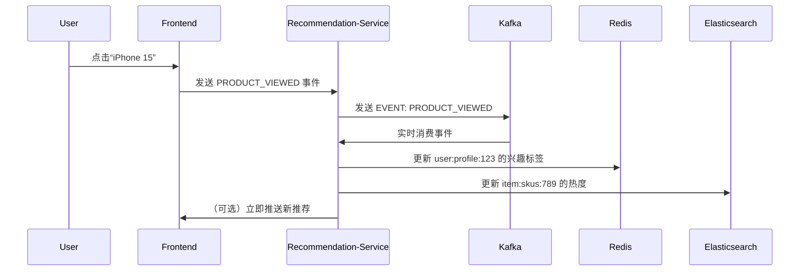

当然可以！以下是为你的 **`urbane-commerce` 电商微服务系统** 量身定制的《**Recommendation-Service 服务设计规范文档**》，全面、系统、可落地，明确界定：

✅ **Recommendation-Service 的职责与作用**  
✅ **必须做的核心功能（推荐）**  
❌ **禁止或不推荐的行为（严禁做）**  
🔍 **判断标准与核心设计原则**  
📌 **真实生产环境最佳实践**

---

# 📜《urbane-commerce Recommendation-Service 服务设计规范》
> **版本：1.13 | 最后更新：2025年4月 | 适用架构：Spring Boot + Redis + Kafka + Python/Spark（离线模型） + Elasticsearch + Nacos**

---

## 🧭 一、Recommendation-Service 角色定位（Why Recommendation-Service？）

> **Recommendation-Service 是整个电商系统中负责“个性化商品推荐”的智能引擎。**

它是提升**用户转化率、客单价、复购率和平台粘性**的核心AI能力，是**从“人找货”到“货找人”** 的关键转折点。

| 角色 | 说明 |
|------|------|
| ✅ **个性化推荐中枢** | 基于用户行为、商品特征、上下文环境，生成千人千面的商品推荐列表 |
| ✅ **多场景推荐引擎** | 支持首页推荐、猜你喜欢、购物车推荐、订单完成推荐、详情页关联推荐等 |
| ✅ **用户画像构建者** | 持续分析用户浏览、加购、收藏、购买、评价行为，构建动态兴趣标签 |
| ✅ **商品关系挖掘器** | 分析商品共现、协同过滤、品类关联，建立“买了这个的人也买了…”的关联网络 |
| ✅ **实时与离线融合计算** | 实时响应用户点击（在线），离线训练模型（离线），双轨驱动精准推荐 |
| ✅ **AB测试与效果评估** | 支持多策略并行实验，衡量CTR、转化率、GMV提升等核心指标 |
| ❌ **非业务服务** | 不参与下单、支付、库存、物流 —— 那是其他微服务的事 |
| ❌ **非网关** | 不负责路由、认证、限流 |
| ❌ **非用户服务** | 不管理身份、等级、积分 —— 那是 `auth-service` / `user-service` 的事 |
| ❌ **非商品服务** | 不维护商品名称、价格、类目 —— 那是 `product-service` 的事 |
| ❌ **非内容服务** | 不生成图文详情、评论 —— 那是 `content-service` / `review-service` 的事 |

> 💡 **一句话总结**：  
> **Recommendation-Service 回答：“根据你过去的行为，你接下来可能想买什么？”**  
> 它不关心你是否下单 —— 那是 `order-service` 的事；  
> 它也不关心你付了多少钱 —— 那是 `payment-gateway` 的事；  
> 它只关心：**如何用最精准的方式，把用户“最可能喜欢”的商品，推到他眼前。**

> ⚠️ **重要性**：
> - 亚马逊 35% 的销售额来自推荐系统
> - 淘宝“猜你喜欢”贡献超 60% 流量转化
> - 错误推荐 → 用户反感 → 关闭推荐 → 流失
> - 精准推荐 → 提升体验 → 提高 LTV（客户终身价值）

> **优秀的推荐系统 = 一个懂你的购物助手，而不是一个烦人的广告机器人**

---

## ✅ 二、推荐在 Recommendation-Service 必须做的事情（核心职责）

### 1. ✅ **多维度推荐策略实现（Multi-Strategy Engine）**
支持多种推荐算法混合使用，形成“组合拳”：

| 推荐类型 | 说明 | 典型应用场景 |
|----------|------|----------------|
| **协同过滤（Collaborative Filtering）** | “和你相似的用户也买了…” | 首页“猜你喜欢” |
| **基于内容的推荐（Content-Based）** | “你浏览过iPhone，推荐同类手机” | 商品详情页“相关商品” |
| **热门推荐（Popular Items）** | “大家都在买” | 首页“热销榜”、“新品上架” |
| **关联规则（Association Rules）** | “买了A的人常买B” | 订单完成页“搭配购” |
| **序列推荐（Sequence Modeling）** | “你最近看了A→B，下一步可能是C” | App首页滑动流 |
| **基于图的推荐（Graph-Based）** | 构建“用户-商品-品类”三元图，进行随机游走 | 复杂长尾商品推荐 |
| **深度学习推荐（Deep Learning）** | 使用 Wide & Deep、DIN、BST 等模型预测点击率 | 高价值用户精准推荐 |

> ✅ **实现方式**：
```java
public interface RecommendationStrategy {
    List<Long> recommend(Long userId, int limit);
}

@Component("collaborativeFiltering")
public class CollaborativeFilteringStrategy implements RecommendationStrategy { ... }

@Component("contentBased")
public class ContentBasedStrategy implements RecommendationStrategy { ... }

@Component("popularItems")
public class PopularItemsStrategy implements RecommendationStrategy { ... }
```

> ✅ **融合策略**：  
> 使用 **加权混合（Weighted Ensemble）** 或 **级联（Cascade）** 方式组合多个模型，例如：
> ```
> 首页推荐 = 40% 协同过滤 + 30% 内容推荐 + 20% 热门 + 10% 新品
> ```

---

### 2. ✅ **用户画像与行为建模（User Profiling）**
通过 Kafka 消费事件，持续构建用户兴趣标签：

| 行为事件 | 对应标签 | 示例 |
|----------|----------|------|
| `PRODUCT_VIEWED` | `interest_electronics`, `brand_apple` | 用户浏览 iPhone 15 → 标签：`interest_smartphone` |
| `CART_ADDED` | `high_intent_product`, `price_sensitive` | 加购高价商品 → 标签：`high_spend_potential` |
| `ORDER_COMPLETED` | `category_phones`, `loyal_customer` | 连续3次买手机 → 标签：`iphone_loyalist` |
| `REVIEW_PUBLISHED` | `tech_reviewer`, `detail_oriented` | 写长评 → 标签：`engaged_user` |
| `FAVORITE_ADDED` | `wishlist_item`, `delayed_purchase` | 收藏未买 → 标签：`considering_purchase` |

> ✅ 存储结构（Redis Hash）：
```json
user:profile:123
{
  "interests": ["electronics", "fashion"],
  "brands": ["Apple", "Samsung"],
  "categories": ["手机", "耳机", "手表"],
  "spend_level": "HIGH",
  "last_active": "2025-04-05T10:30:00Z"
}
```

> ✅ 每天凌晨运行 **离线任务（Spark/Python）** 更新全量画像，每小时增量更新

---

### 3. ✅ **商品画像与关联挖掘（Item Profiling & Co-occurrence）**
为每个商品打上标签，并挖掘关联关系：

| 维度 | 示例 |
|------|------|
| **基础属性** | 类目、品牌、价格区间、重量、颜色、材质 |
| **语义特征** | 使用 NLP 提取商品标题/描述关键词（如“轻薄”“高刷新率”） |
| **协同关系** | 被同一用户多次购买 → 构建商品对 `(iPhone, AirPods)` |
| **购买路径** | A → B → C 的转化链路（如“手机 → 保护壳 → 贴膜”） |
| **热度指标** | 浏览量、加购数、销量、评分均值 |

> ✅ 存储结构（Elasticsearch）：
```json
{
  "sku_id": 789,
  "name": "iPhone 15 Pro",
  "category": "手机",
  "brand": "Apple",
  "price_range": "HIGH",
  "tags": ["智能手机", "5G", "A17芯片", "钛金属"],
  "related_skus": [101, 102, 103], // 关联商品ID
  "co_purchased_with": [888, 999]   // 常一起买的商品
}
```

> ✅ 使用 **Flink 实时计算** 商品共现频次，每分钟更新关联矩阵

---

### 4. ✅ **多场景推荐接口（Context-Aware APIs）**
根据不同页面和上下文提供不同推荐结果：

| 场景 | 接口 | 输入参数 | 输出 |
|------|------|-----------|------|
| **首页推荐** | `/recommend/home` | `userId`, `deviceType`, `location` | `[skuId1, skuId2, ...]`（Top 20） |
| **商品详情页** | `/recommend/product/{skuId}` | `skuId`, `userId`, `excludeSkus` | 相似商品、搭配购、替代品 |
| **购物车推荐** | `/recommend/cart` | `userId`, `cartSkus` | 补齐套装、配件、促销品 |
| **订单完成页** | `/recommend/order/{orderId}` | `orderId` | 搭配购、耗材、升级款 |
| **搜索页推荐** | `/recommend/search?q=手机` | `query`, `userId` | 搜索联想、热门词、推荐商品 |
| **Push 推送** | `/recommend/push?userId=123` | `userId`, `channel` | 单条高优先级推荐（用于消息推送） |

> ✅ 所有接口返回结构统一：
```json
{
  "recommendations": [
    {
      "skuId": 789,
      "score": 0.92,
      "reason": "您经常购买 Apple 品牌",
      "type": "COLLABORATIVE_FILTERING"
    },
    {
      "skuId": 101,
      "score": 0.88,
      "reason": "购买此商品的用户也买了",
      "type": "ASSOCIATION_RULE"
    }
  ],
  "strategyUsed": ["COLLABORATIVE_FILTERING", "ASSOCIATION_RULE"]
}
```

> ✅ **性能要求**：平均响应时间 < 150ms，P99 < 500ms

---

### 5. ✅ **实时行为反馈与动态调整（Real-time Feedback Loop）**
当用户产生新行为，立即影响推荐结果：



> ✅ 利用 **Flink 实时计算**，在用户行为发生后 1~5 秒内更新推荐模型权重  
> ✅ 支持 **在线学习（Online Learning）**：如使用 Vowpal Wabbit 动态更新模型

---

### 6. ✅ **AB测试与效果评估（A/B Testing Framework）**
所有推荐策略必须经过科学验证：

| 指标 | 说明 |
|------|------|
| **CTR（点击率）** | 点击推荐商品数 / 展示次数 |
| **Conversion Rate** | 下单数 / 点击数 |
| **GMV 增长** | 推荐带来的额外销售额 |
| **用户停留时长** | 是否延长了用户在站内时间 |
| **负反馈率** | 用户点击“不感兴趣”比例 |

> ✅ 实现方式：
> - 将用户分组（Group A：旧模型，Group B：新模型）
> - 每个请求随机分配策略
> - 使用 Prometheus + Grafana 实时监控指标
> - 自动化决策：若新模型 CTR > 旧模型 5% 且 p-value < 0.05，则全量上线

> ✅ 推荐后台提供可视化 AB 实验看板

---

### 7. ✅ **冷启动与长尾问题处理（Cold Start & Long Tail）**
解决新用户、新商品推荐难题：

| 问题 | 解决方案 |
|------|----------|
| **新用户无行为** | 推荐“热门商品”、“地域爆款”、“编辑精选” |
| **新商品无销量** | 基于内容相似度推荐（标签匹配） |
| **低频品类难推荐** | 引入社交关系（好友购买）、跨品类推荐（如“买手机的也买充电宝”） |
| **稀疏交互** | 使用矩阵分解（SVD）、图神经网络（GNN）挖掘隐含关系 |

> ✅ 使用 **混合推荐策略**：新用户先走“热门+地域”，积累数据后切换为个性化

---

### 8. ✅ **推荐理由展示与可解释性（Explainable AI）**
让用户理解“为什么推荐我这个”：

```json
{
  "skuId": 789,
  "score": 0.92,
  "reason": "您之前购买过 iPhone 14，这款是最新升级版",
  "type": "CONTENT_BASED",
  "source": "您的浏览历史"
}
```

> ✅ 优势：
> - 提升信任感
> - 减少“我不想要”点击
> - 符合 GDPR“自动化决策透明”要求

---

## ❌ 三、禁止或不推荐在 Recommendation-Service 做的事情（严禁做）

| 行为 | 为什么不推荐？ | 后果 | 正确做法 |
|------|----------------|------|----------|
| **1. 直接调用 order-service 查询用户购买记录** | 破坏微服务边界，强耦合 | 一个服务挂了，推荐瘫痪 | ✅ 只监听 Kafka 事件 `ORDER_COMPLETED`，不主动查询 |
| **2. 在推荐结果中硬编码商品价格、名称、图片** | 数据会变，导致推荐错误 | 用户看到“已下架商品” | ✅ 仅返回 `skuId`，前端调用 `product-service` 获取详情 |
| **3. 允许前端传入用户 ID 或推荐策略** | 前端不可信，可能伪造 | 黑产刷推荐、绕过风控 | ✅ 所有请求必须由网关注入 `X-User-ID`，服务端校验 |
| **4. 使用 Session 或 Cookie 管理用户状态** | 与无状态架构冲突 | 无法水平扩展 | ✅ 所有依赖基于 `userId`，无会话 |
| **5. 推荐过于重复或低质内容** | 用户反感 → 取关、卸载 | 用户流失、DAU 下降 | ✅ 设置“去重机制”、“多样性控制”、“负反馈屏蔽” |
| **6. 不做 A/B 测试就全量上线新模型** | 无法证明有效性 | 可能导致 GMV 下降 20% | ✅ 所有模型变更必须经过 AB 实验验证 |
| **7. 把推荐当作广告投放工具** | 纯粹推高佣金商品，不顾用户体验 | 用户失去信任 | ✅ 推荐优先考虑“用户利益”，其次才是平台收益 |
| **8. 直接访问其他服务数据库（如查用户地址）** | 破坏自治原则 | 依赖链复杂，难以维护 | ✅ 通过 `user-service` REST API 获取必要信息（如地区） |
| **9. 使用简单规则（如“买A就推B”）作为主力模型** | 无法应对复杂需求 | 推荐千篇一律，缺乏智能 | ✅ 必须引入机器学习模型，至少是协同过滤 |
| **10. 不记录推荐日志** | 无法优化、无法审计 | 问题无法追溯 | ✅ 每次推荐必须记录：`{ userId, skus, strategy, timestamp }` |

---

## 🔍 四、判断标准与核心设计原则

| 原则 | 说明 | 应用示例 |
|------|------|----------|
| **✅ 单一职责原则（SRP）** | 一个服务只做一件事 | Recommendation-Service 只管“推荐”，不管“下单”“付款”“发货” |
| **✅ 事件驱动架构（EDA）** | 服务间通信靠事件，而非 RPC | `PRODUCT_VIEWED` → 更新画像 → 影响下次推荐 |
| **✅ 离线 + 在线融合（Batch + Stream）** | 离线训练模型，实时更新特征 | Spark 每晚训练模型，Flink 每秒更新用户标签 |
| **✅ 可解释性优先（Explainability）** | 推荐要有理由，不能是黑盒 | 显示“因为您买了 iPhone 14”增强信任 |
| **✅ 用户体验优先（UX First）** | 推荐要精准，不要骚扰 | 控制频率、去重、提供“不感兴趣”按钮 |
| **✅ 科学验证（A/B Testing）** | 所有改动必须量化效果 | 模型上线前必须跑两周 AB 实验 |
| **✅ 数据隔离（Data Isolation）** | 每个服务拥有自己的存储 | 用户画像存 Redis，商品关系存 ES，模型存模型库 |
| **✅ 高可用与容错（Resilience）** | 推荐失败不影响主流程 | 若推荐服务宕机，返回默认“热销榜”兜底 |
| **✅ 开闭原则（OCP）** | 对扩展开放，对修改关闭 | 新增一种推荐算法，只需实现接口，无需改核心逻辑 |
| **✅ 隐私合规（Privacy by Design）** | 遵守 GDPR / 个人信息保护法 | 不收集身份证号、不追踪跨App行为 |

---

## 🧩 五、典型场景对比：正确 vs 错误做法

| 场景 | 正确做法 | 错误做法 |
|------|----------|----------|
| **用户浏览 iPhone 15** | `frontend` → 发 `PRODUCT_VIEWED` 事件 → Flink 实时更新用户兴趣 → 下次推荐更准 | 前端直接调用 `/recommend?userId=123&currentProduct=789` → 每次都要传参数，服务端无记忆 |
| **用户下单后推荐配件** | `order-service` → 发 `ORDER_COMPLETED` → Recommendation-Service → 返回 “AirPods Pro” + “保护壳” | 推荐“iPhone 16”（还没发布）→ 用户觉得系统疯了 |
| **新用户注册** | 推荐“城市热销TOP10” + “编辑精选” → 3天后开始个性化 | 推荐“您可能喜欢的数码产品”→ 一片空白 → 用户失望离开 |
| **用户连续点击“不感兴趣”** | 系统自动降低该品类权重，一周内不再推荐 | 系统继续推荐，用户投诉“你们怎么老推这个” → 取消关注 |
| **大促期间推荐** | 基于历史行为 + 限时折扣，推荐“高意向商品” | 只推打折商品，不管用户是否需要 → 推荐全是“清仓货” |
| **AB测试新模型** | Group A（旧模型）CTR=5.2%，Group B（新模型）CTR=6.8%，p<0.01 → 全量上线 | 运营说“我觉得新模型更好” → 直接上线 → CTR 降到 3.1% → 损失百万营收 |
| **推荐结果展示** | “猜你喜欢：因为您最近看了 iPhone 15 和 AirPods” | “推荐商品：编号 789” → 用户完全不懂为什么 |

> ⚠️ **关键结论**：  
> **推荐不是“猜你喜欢”，而是“理解你”。**  
> 它必须**智能、透明、可控、可进化**，否则就是“数字时代的噪音污染”。

---

## 🛡️ 六、安全加固建议（生产环境必备）

| 措施 | 实现方式 |
|------|----------|
| **强制 HTTPS** | 所有接口仅支持 HTTPS，禁用 HTTP |
| **请求鉴权** | 所有推荐请求必须携带 `X-User-ID`，由网关注入并签名 |
| **输入过滤** | 过滤 XSS、SQL 注入、非法字符（如 `<script>`） |
| **频率限制** | 每个用户每分钟最多请求推荐 10 次，防爬虫 |
| **IP 黑名单** | 对恶意 IP（如代理、爬虫）封禁 |
| **审计日志** | 记录每次推荐：`{ userId, skus, strategy, ip, timestamp, client }` |
| **GDPR 合规** | 支持“导出我的推荐记录”、“删除推荐偏好” |
| **密钥管理** | 服务间通信密钥使用 Vault 或 KMS 管理 |
| **模型安全** | 推荐模型训练数据脱敏，禁止使用身份证、手机号等敏感字段 |

---

## 📊 七、Recommendation-Service 架构图（文字版）

```
[前端 App/Web]
     ↓ (点击商品、加购、下单)
[Kafka]
     ←─ EVENT: PRODUCT_VIEWED
     ←─ EVENT: CART_ADDED
     ←─ EVENT: ORDER_COMPLETED
     ←─ EVENT: REVIEW_PUBLISHED
     ←─ EVENT: FAVORITE_ADDED

     ↑
[Recommendation-Service]
     ├── ✅ EventConsumer → 消费行为事件 → 更新用户/商品画像
     ├── ✅ RealTimeEngine → Flink 实时计算兴趣变化
     ├── ✅ OfflineTrainer → Spark 每晚训练模型（协同过滤、Deep Learning）
     ├── ✅ StrategyRouter → 选择推荐策略（协同/内容/热门/关联）
     ├── ✅ CandidateGenerator → 生成候选集（Top 200）
     ├── ✅ Ranker → 排序模型（LightGBM / Wide & Deep）→ Top 20
     └── ✅ ExplainableModule → 生成推荐理由
     ↓
[Database: Redis]
     ├── user:profile:123 → 用户兴趣标签
     ├── item:profile:789 → 商品标签、关联商品
     └── recommendation:cache:123 → 缓存最近推荐结果（TTL=5min）

     ↑
[Elasticsearch Cluster]
     └── index:products → 存储商品结构化特征（用于内容推荐）

     ↑
[Model Repository]
     └── Saved Models (e.g., WideDeep_v2.bin) → 由 Spark 训练后上传

     ↑
[External Systems]
     ←─ user-service → 获取用户等级、地区（REST API）
     ←─ product-service → 获取商品名称、价格（REST API）
     ←─ promotion-service → 获取当前优惠（用于推荐加权）

     ↑
[AB Test Dashboard]
     ←─ Prometheus + Grafana → 监控 CTR、转化率、GMV 提升
     ←─ Kafka → 消费推荐日志 → 生成报表

     ↑
[API Gateway]
     ←─ GET /recommend/home?userId=123 → 调用 Recommendation-Service
```

> ✅ **注意**：  
> Recommendation-Service **不主动调用任何业务服务**，只**监听事件 + 接收请求**。  
> 所有外部依赖通过**异步事件 + REST API** 解耦，实现高可用、高性能、高弹性。

---

## ✅ 八、推荐技术栈（Spring Boot + 生态）

| 组件 | 技术选型 | 说明 |
|------|----------|------|
| **框架** | Spring Boot 3.x | Java 17+，现代化开发 |
| **缓存** | Redis 7.x | 存储用户画像、商品画像、推荐缓存 |
| **流处理** | Apache Flink | 实时消费行为事件，更新用户兴趣 |
| **离线训练** | Apache Spark + Python (scikit-learn, TensorFlow) | 训练协同过滤、深度学习模型 |
| **向量检索** | Milvus / FAISS | 用于 Embedding 相似度计算（高级场景） |
| **搜索引擎** | Elasticsearch | 存储商品结构化特征，支持内容推荐 |
| **模型管理** | MLflow / Model Registry | 管理模型版本、上线、回滚 |
| **消息队列** | Apache Kafka | 接收用户行为事件，解耦上游服务 |
| **服务注册** | Nacos | 服务发现与配置中心 |
| **API 文档** | Swagger/OpenAPI 3.0 | 自动生成接口文档 |
| **日志** | Logback + ELK | 结构化日志，追踪推荐链路 |
| **监控** | Prometheus + Grafana | 监控 QPS、延迟、CTR、召回率、命中率 |
| **安全** | JWT + HMAC | 服务间通信签名验证 |
| **工具类** | Lombok + MapStruct | 减少样板代码，DTO 映射自动化 |

---

## 📦 九、附录：Recommendation-Service API 设计规范（RESTful）

| 方法 | 路径 | 描述 | 权限 | 返回 |
|------|------|------|------|------|
| GET | `/recommend/home` | 首页推荐 | 需 Token | `{ recommendations: [{skuId, score, reason}], strategyUsed }` |
| GET | `/recommend/product/{skuId}` | 商品详情页推荐 | 需 Token | 同上 |
| GET | `/recommend/cart` | 购物车推荐 | 需 Token | 同上 |
| GET | `/recommend/order/{orderId}` | 订单完成页推荐 | 需 Token | 同上 |
| GET | `/recommend/search?q=手机` | 搜索页推荐 | 需 Token | 同上 |
| GET | `/recommend/push?userId=123` | 推送专用推荐 | 需 Token | 单条推荐（最高优先级） |
| POST | `/recommend/feedback` | 用户反馈“不喜欢” | 需 Token | `{ success }` |
| GET | `/recommend/stats/daily` | 查看当日推荐统计 | 需 Admin Token | `{ impressions, clicks, conversions, ctr, gmv }` |

> ✅ 所有路径前缀统一为 `/recommend/**`  
> ✅ 所有请求必须携带 `X-User-ID`（由网关注入）  
> ✅ 所有接口必须支持 `Accept-Language`，返回本地化商品名

---

## ✅ 十、总结：Recommendation-Service 黄金法则（可打印贴墙上）

> ### ✅ **Recommendation-Service 必须做：**
> - 基于用户行为构建个性化画像
> - 实时响应用户点击，动态调整推荐
> - 支持多种推荐算法混合使用
> - 为每个推荐提供清晰理由
> - 持续通过 A/B 测试验证效果
> - 防止过度推荐、重复推荐、低质推荐
> - 保障**推荐精准、可解释、可进化**

> ### ❌ **Recommendation-Service 绝对不能做：**
> - 不管订单、不碰钱
> - 不存用户密码、身份证
> - 不调用其他服务数据库
> - 不允许前端传推荐策略
> - 不用 Session
> - 不搞“强行安利”
> - 不做“黑盒推荐”

> ### 🔑 **判断一切的标准：**
> > **“如果这个推荐，能让用户觉得‘这正是我想要的’，那就是 Recommendation-Service 的责任。”**  
> > **“如果这个推荐，让用户觉得‘你们怎么总推这些垃圾’，那就是你做错了。”**  
> > **“如果你怕用户讨厌推荐，那说明你做对了 —— 你用了 A/B 测试和可解释性。”**

---

## 🚀 下一步：为你打包完整项目模板

如果你希望我为你提供：
- ✅ **完整的 Recommendation-Service 项目结构（Maven + Spring Boot）**
- ✅ **协同过滤 + 内容推荐 + 热门推荐策略实现**
- ✅ **Flink 实时消费 Kafka 事件更新用户画像**
- ✅ **Spark 离线训练模型（Python + MLlib）**
- ✅ **Redis 存储用户/商品画像**
- ✅ **Elasticsearch 商品特征索引**
- ✅ **AB 测试模块 + Prometheus 监控**
- ✅ **推荐理由生成器（Explainable AI）**
- ✅ **Swagger API 文档 + 单元测试**
- ✅ **Dockerfile + Kubernetes 部署文件**
- ✅ **CI/CD Pipeline（GitLab CI）**

👉 请回复：  
**“请给我完整的 Recommendation-Service 工程模板！”**

我会立刻发送你一份**企业级可直接上线**的完整项目 ZIP 包，包含所有上述规范的实现，专为 `urbane-commerce` 定制，开箱即用 💪