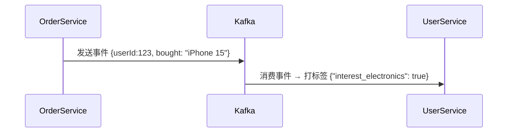

当然可以！以下是为你的 **`urbane-commerce` 电商微服务系统** 量身定制的《**User-Service 服务设计规范文档**》，全面、系统、可落地，明确界定：

✅ **User-Service 的职责与作用**  
✅ **必须做的核心功能（推荐）**  
❌ **禁止或不推荐的行为（严禁做）**  
🔍 **判断标准与核心设计原则**  
📌 **真实生产环境最佳实践**

---

# 📜《urbane-commerce User-Service 服务设计规范》
> **版本：1.4 | 最后更新：2025年4月 | 适用架构：Spring Boot + MySQL + Redis + Nacos + JWT**

---

## 🧭 一、User-Service 角色定位（Why User-Service？）

> **User-Service 是整个系统中负责“用户个人数据全生命周期管理”的核心业务服务。**

它不是 Auth-Service，也不是网关，而是：

| 角色 | 说明 |
|------|------|
| ✅ **用户资料中心** | 管理用户的非敏感个人信息：昵称、头像、性别、地址、偏好等 |
| ✅ **用户画像引擎** | 存储用户行为标签、消费等级、兴趣分类，支撑个性化推荐 |
| ✅ **收货地址管理** | 增删改查用户收货地址（支持默认地址） |
| ✅ **用户偏好设置** | 记录语言、通知方式、主题风格、隐私设置等 |
| ✅ **用户成长体系** | 积分、等级、会员状态、签到记录等运营数据 |
| ✅ **用户关系网络** | 关注/粉丝、好友关系（如社交电商场景） |
| ❌ **非认证服务** | 不处理登录、Token、密码、权限 —— 那是 `auth-service` 的事 |
| ❌ **非业务服务** | 不参与下单、支付、库存、评价 —— 那是其他服务的事 |
| ❌ **非网关** | 不接收外部请求路由，不校验身份 |

> 💡 **一句话总结**：  
> **Auth-Service 回答：“你是谁？”**  
> **User-Service 回答：“你长什么样？你喜欢什么？你住哪？”**

---

## ✅ 二、推荐在 User-Service 必须做的事情（核心职责）

### 1. ✅ 用户基本信息管理（CRUD）
- 存储和维护用户基础档案：
  ```json
  {
    "id": 123,
    "username": "zhangsan",
    "nickname": "小张",
    "avatar": "https://cdn.example.com/avatar/123.jpg",
    "gender": "MALE",
    "birthday": "1990-05-15",
    "email": "zhangsan@example.com",
    "phone": "138****1234", // 可选，脱敏存储
    "status": "ACTIVE",     // ACTIVE, FROZEN, DELETED
    "created_at": "2024-01-01T00:00:00Z"
  }
  ```
- 支持前端通过 Token 调用 `/user/me` 更新自己的信息（需鉴权）
- **禁止暴露手机号、身份证等敏感字段给前端**

> ✅ **关键点**：  
> 手机号、身份证应存储在独立的 `security-profile-service` 或加密字段中，User-Service 只存脱敏后值。

---

### 2. ✅ 收货地址管理（Address Management）
- 支持增删改查多个地址
- 每个地址包含：
  ```json
  {
    "id": 456,
    "user_id": 123,
    "name": "张三",
    "phone": "138****1234",
    "province": "广东省",
    "city": "广州市",
    "district": "天河区",
    "detail": "珠江新城XX大厦A座1001",
    "is_default": true,
    "created_at": "2024-01-02T10:00:00Z"
  }
  ```
- 提供接口：
    - `POST /user/addresses` —— 新增地址
    - `PUT /user/addresses/{id}` —— 修改地址
    - `DELETE /user/addresses/{id}` —— 删除地址
    - `GET /user/addresses/default` —— 获取默认地址
    - `GET /user/addresses` —— 获取全部地址

> ✅ 地址变更需记录操作日志（用于售后追溯）

---

### 3. ✅ 用户偏好与设置管理
- 存储用户个性化配置：
  ```json
  {
    "user_id": 123,
    "language": "zh-CN",
    "theme": "dark",
    "notification_email": true,
    "notification_sms": false,
    "notification_push": true,
    "auto_checkout": false,
    "show_price_tax_included": true
  }
  ```
- 接口示例：
    - `GET /user/settings`
    - `PUT /user/settings`

> ✅ 偏好数据用于前端 UI 自适应、营销策略精准推送

---

### 4. ✅ 用户画像与标签管理（User Profile & Tags）
- 存储用户行为衍生的标签：
    - 消费能力：`HIGH`, `MID`, `LOW`
    - 兴趣品类：`ELECTRONICS`, `FASHION`, `BOOKS`
    - 活跃度：`DAILY`, `WEEKLY`, `MONTHLY`
    - 会员等级：`GOLD`, `PLATINUM`, `DIAMOND`
- 支持：
    - 标签自动打标（基于购买历史、浏览行为）
    - 标签手动调整（运营后台）
    - 标签查询（用于推荐系统、精准营销）

> 🔗 **联动建议**：  
> 用户行为由 `order-service`、`product-service` 通过消息队列（Kafka）异步推送给 `user-service`，实现**事件驱动画像更新**



---

### 5. ✅ 用户成长体系（积分、等级、签到）
- 积分系统：
    - 注册+100分
    - 每笔订单+1%金额
    - 评论商品+20分
- 等级规则：
    - 0–500分：普通用户
    - 501–2000分：白银会员
    - 2001–5000分：黄金会员
    - >5000分：钻石会员
- 签到系统：
    - 连续签到奖励递增
    - 签到记录可查询

> ✅ 接口：
> - `GET /user/points` —— 查看当前积分
> - `POST /user/checkin` —— 签到
> - `GET /user/level` —— 查看等级

> 💡 优势：提升用户活跃度、增强粘性、促进复购

---

### 6. ✅ 用户关系网络（社交电商扩展）
- 若为社交型电商（如拼多多、小红书），支持：
    - 关注/取关其他用户
    - 查看粉丝列表
    - 查看关注列表
    - 获取共同关注人

> ✅ 示例表结构：
> ```sql
> CREATE TABLE user_follows (
>   follower_id BIGINT,
>   following_id BIGINT,
>   created_at TIMESTAMP,
>   PRIMARY KEY (follower_id, following_id)
> );
> ```

---

### 7. ✅ 数据同步与聚合（Event-Driven）
- 接收来自其他服务的事件，更新用户状态：
  | 来源服务 | 事件类型 | User-Service 动作 |
  |----------|-----------|------------------|
  | `order-service` | `ORDER_COMPLETED` | 更新累计消费额、升级会员等级 |
  | `review-service` | `REVIEW_PUBLISHED` | 增加“评论达人”标签 |
  | `cart-service` | `CART_ADDED` | 更新“浏览偏好”标签 |
  | `auth-service` | `USER_REGISTERED` | 创建用户档案（仅限注册成功） |

> ✅ 使用 **Kafka / RabbitMQ** 实现异步解耦，避免直接调用造成阻塞

---

## ❌ 三、禁止或不推荐在 User-Service 做的事情（严禁做）

| 行为 | 为什么不推荐？ | 后果 | 正确做法 |
|------|----------------|------|----------|
| **1. 处理登录、注册、密码重置** | 这是 `auth-service` 的职责 | 职责混乱，重复开发，安全风险高 | ✅ 仅接收 `USER_REGISTERED` 事件创建档案，不处理密码逻辑 |
| **2. 存储用户密码、Token、Salt** | 密码属于核心安全凭证，必须隔离 | 一旦泄露，全站账户被攻破 | ✅ 密码只存在于 `auth-service` 的数据库，User-Service 不接触 |
| **3. 直接访问订单、商品、库存数据** | 破坏微服务边界，形成强依赖 | 一个服务挂了，User-Service 也瘫痪 | ✅ 通过事件总线接收变化，不主动查询其他服务 |
| **4. 实现权限校验（Authorization）** | “你能改别人资料吗？”是业务逻辑，应由调用方（如网关/服务）校验 | 权限逻辑分散，难以统一维护 | ✅ 网关传入 `X-User-ID`，User-Service 仅校验 `当前用户 == 请求用户` |
| **5. 返回敏感信息（手机号、身份证、银行卡）** | 违反 GDPR / 个人信息保护法 | 法律风险、用户信任崩塌 | ✅ 敏感字段由 `security-profile-service` 存储，User-Service 仅返回脱敏值（如 138****1234） |
| **6. 接收前端直接传入 userId 或 role** | 前端不可信，可能伪造身份 | A 用户修改 B 用户的头像 | ✅ 所有操作必须通过 `X-User-ID` 与 JWT 中的 `sub` 字段比对 |
| **7. 调用 payment-gateway 或 logistics-service** | User-Service 不是协调者 | 耦合严重，无法独立部署 | ✅ 使用事件驱动，如 `ORDER_PAID` → 触发积分发放 |
| **8. 缓存用户所有数据到 Redis 并设置长期过期** | 内存浪费、数据不一致 | 用户修改了地址，缓存还是旧的 | ✅ 缓存高频读取字段（如头像、昵称），TTL ≤ 5min，写操作立即失效 |
| **9. 在 User-Service 中拼接响应体（如返回 {user, address, orderCount}）** | 违背单一职责 | 成为“BFF”，失去独立性 | ✅ 由 `bff-service` 聚合多个服务数据，User-Service 只返回自身数据 |
| **10. 作为唯一用户 ID 生成器** | ID 应由全局唯一服务生成（如 Snowflake） | 分布式下易冲突 | ✅ 使用 `id-generator-service` 或数据库自增 + UUID |

---

## 🔍 四、判断标准与核心设计原则

| 原则 | 说明 | 应用示例 |
|------|------|----------|
| **✅ 单一职责原则（SRP）** | 一个服务只做一件事 | User-Service 只管“用户资料”，不管“登录”“订单”“支付” |
| **✅ 无状态性（Statelessness）** | 每次请求独立，不依赖内存状态 | 所有操作基于 Token 鉴权，服务无 Session |
| **✅ 微服务自治（Autonomy）** | 每个服务可独立部署、升级、回滚 | User-Service 升级不影响 Auth-Service，反之亦然 |
| **✅ 数据最小化（Data Minimization）** | 只收集和暴露最少必要信息 | 不向客户端返回手机号、身份证、银行卡 |
| **✅ 安全纵深防御（Defense in Depth）** | 多层防护，防止单点突破 | 网关校验 Token → User-Service 校验 owner → 数据库加权限锁 |
| **✅ 事件驱动架构（EDA）** | 服务间通信通过事件，而非 RPC | 订单完成 → 发送事件 → User-Service 更新积分 |
| **✅ 开闭原则（OCP）** | 对扩展开放，对修改关闭 | 新增“会员权益”只需加新字段，不改原有逻辑 |
| **✅ 可观测性优先（Observability）** | 所有操作必须可追踪 | 每次更新用户资料记录操作日志、IP、时间、设备 |
| **✅ 接口契约清晰（Contract First）** | API 文档先行，前后端依约开发 | 使用 OpenAPI 3.0 定义 `/user/addresses` 接口 |
| **✅ 高内聚低耦合（Loose Coupling）** | 服务内部紧密相关，对外依赖少 | User-Service 内部有 Address、Profile、Points 模块，但不依赖 OrderService |

---

## 🧩 五、典型场景对比：正确 vs 错误做法

| 场景 | 正确做法 | 错误做法 |
|------|----------|----------|
| **用户修改头像** | 前端 → 网关 → `user-service`/me/avatar（带 Token）→ 上传图片 → 更新数据库 → 返回新 URL | 前端 → 网关 → `order-service` → order-service 调用 user-service 修改头像 → 耦合严重 |
| **查看收货地址** | 前端 → 网关 → `user-service`/addresses → 返回该用户所有地址 | 前端 → 网关 → `order-service`/123/address → order-service 查询 user-service → 性能差 |
| **用户签到得积分** | 用户点击签到 → `user-service`/checkin → 本地增加积分 → 发送 `USER_CHECKIN` 事件 → 异步触发奖励邮件 | 用户签到 → `auth-service` 判断并增加积分 → Auth-Service 管理积分，职责越界 |
| **用户升级为黄金会员** | `order-service` 发送 `ORDER_COMPLETED` 事件 → `user-service` 消费 → 累计消费 ≥5000 → 更新等级 | `order-service` 直接调用 `user-service/updateLevel(userId, 'GOLD')` → 同步阻塞，失败率高 |
| **前端展示用户名** | 前端从 `user-service`/me 获取 `nickname`，显示在顶部 | 前端从 `order-service` 的响应中提取 `userName`，导致字段名不一致、格式混乱 |

> ⚠️ **关键结论**：  
> **User-Service 是“用户数据的权威来源”——但只提供“我拥有的数据”，不提供“别人的数据”。**

---

## 🛡️ 六、安全加固建议（生产环境必备）

| 措施 | 实现方式 |
|------|----------|
| **强制 HTTPS** | 所有接口仅支持 HTTPS，禁用 HTTP |
| **输入过滤** | 过滤 XSS、SQL 注入、Unicode 混淆字符（如 `&#x3C;script&#x3E;`） |
| **字段脱敏** | 手机号、邮箱返回时自动掩码：`138****1234`、`z***@example.com` |
| **权限校验** | 每次更新/删除操作，必须校验 `X-User-ID == request.userId` |
| **审计日志** | 所有写操作记录：`{ action: "UPDATE_AVATAR", userId: 123, ip: "192.168.1.10", device: "iPhone" }` |
| **并发控制** | 防止重复提交（如多次签到）→ 使用 Redis 分布式锁 |
| **数据加密** | 敏感字段（如手机号）使用 AES-256 加密存储，密钥由 KMS 管理 |
| **访问频率限制** | `/user/addresses` 每分钟最多 10 次，防爬虫 |
| **GDPR 合规** | 支持用户申请“导出数据”、“删除账户”（软删除 + 数据匿名化） |

---

## 📊 七、User-Service 架构图（文字版）

```
[客户端]
     ↓ (HTTPS + X-User-ID: 123)
[API Gateway] ←─ 验证 Token，透传 X-User-ID
     ↓
[User-Service]
     ├── ✅ /user/me             ←─ 获取用户基本信息（昵称、头像、等级）
     ├── ✅ /user/addresses      ←─ 管理收货地址
     ├── ✅ /user/settings       ←─ 设置偏好
     ├── ✅ /user/points         ←─ 查看积分
     ├── ✅ /user/checkin        ←─ 签到
     ├── ✅ /user/level          ←─ 查看会员等级
     └── ✅ /user/followers      ←─ 社交关系（可选）
     ↓
[Database: MySQL]
     ├── users (id, username, avatar, gender, status...)
     ├── addresses (user_id, name, phone, detail, is_default)
     ├── user_settings (user_id, language, theme, ...)
     ├── user_points (user_id, total_points, level, last_checkin)
     └── user_follows (follower_id, following_id)

     ↑
[Kafka / RabbitMQ]
     ←─ 事件：ORDER_COMPLETED → 更新积分
     ←─ 事件：REVIEW_PUBLISHED → 打标签“评论达人”
     ←─ 事件：USER_REGISTERED → 创建档案
```

> 🔄 **注意**：  
> User-Service **不主动调用其他服务**，只**监听事件**。  
> 所有外部依赖通过**异步事件驱动**解耦。

---

## ✅ 八、推荐技术栈（Spring Boot + 生态）

| 组件 | 技术选型 | 说明 |
|------|----------|------|
| **框架** | Spring Boot 3.x | Java 17+，现代化开发 |
| **数据库** | MySQL 8.0 / PostgreSQL | 结构化存储用户数据，支持事务 |
| **缓存** | Redis | 缓存高频读取字段（头像、昵称、等级），TTL=5min |
| **事件总线** | Apache Kafka | 异步接收订单、评论等事件，实现事件驱动 |
| **服务注册** | Nacos | 服务发现与配置中心 |
| **ORM** | MyBatis-Plus | 简化 CRUD，支持代码生成 |
| **API 文档** | Swagger/OpenAPI 3.0 | 自动生成接口文档 |
| **日志** | Logback + ELK | 结构化日志，便于分析操作轨迹 |
| **监控** | Prometheus + Grafana | 监控 QPS、错误率、平均响应时间 |
| **安全** | Spring Security + JWT | 仅用于鉴权，不涉及认证 |
| **工具类** | Lombok + MapStruct | 减少样板代码，DTO 映射自动化 |

---

## 📦 九、附录：User-Service API 设计规范（RESTful）

| 方法 | 路径 | 描述 | 权限 | 返回 |
|------|------|------|------|------|
| GET | `/user/me` | 获取当前用户基本信息 | 需 Token | `{ id, nickname, avatar, level, points, email }` |
| PUT | `/user/me` | 更新用户信息（昵称、头像等） | 需 Token | `{ success: true }` |
| GET | `/user/addresses` | 获取所有地址 | 需 Token | `[address1, address2, ...]` |
| POST | `/user/addresses` | 新增地址 | 需 Token | `{ id, ... }` |
| PUT | `/user/addresses/{id}` | 修改地址 | 需 Token，且 owner = current user | `{ success: true }` |
| DELETE | `/user/addresses/{id}` | 删除地址 | 需 Token，且 owner = current user | `{ success: true }` |
| GET | `/user/addresses/default` | 获取默认地址 | 需 Token | `{ ... }` |
| PUT | `/user/addresses/{id}/default` | 设置为默认地址 | 需 Token | `{ success: true }` |
| GET | `/user/settings` | 获取偏好设置 | 需 Token | `{ language, theme, notification_email, ... }` |
| PUT | `/user/settings` | 更新偏好设置 | 需 Token | `{ success: true }` |
| GET | `/user/points` | 获取当前积分 | 需 Token | `{ total: 1250, level: "GOLD" }` |
| POST | `/user/checkin` | 签到打卡 | 需 Token | `{ success: true, bonus: 10 }` |
| GET | `/user/level` | 获取会员等级 | 需 Token | `{ level: "GOLD", next_level: "PLATINUM", progress: 65% }` |
| GET | `/user/followers` | 获取粉丝列表 | 需 Token | `[ {id, nickname, avatar}, ... ]` |
| GET | `/user/following` | 获取关注列表 | 需 Token | `[ {id, nickname, avatar}, ... ]` |

> ✅ 所有路径前缀统一为 `/user/**`，清晰易识别  
> ✅ 所有接口必须验证 `X-User-ID == principal.userId`

---

## ✅ 十、总结：User-Service 黄金法则（可打印贴墙上）

> ### ✅ **User-Service 必须做：**
> - 管理用户资料（昵称、头像、性别）
> - 管理收货地址
> - 管理偏好设置
> - 管理积分、等级、签到
> - 管理用户标签与画像
> - 接收事件驱动更新（如订单完成）
> - 返回**干净、脱敏、可控**的用户数据

> ### ❌ **User-Service 绝对不能做：**
> - 不管登录、密码、Token
> - 不存手机号、身份证、银行卡
> - 不调用订单、支付、物流服务
> - 不拼接响应体（如 user + address + order）
> - 不做权限判断（除了 owner 校验）
> - 不用 Session
> - 不是数据仓库（只存自己领域数据）

> ### 🔑 **判断一切的标准：**
> > **“如果这个信息，是‘用户自己’想要管理或查看的，那就是 User-Service 的职责。”**  
> > **“如果这个信息，是‘系统为了运营’需要计算的，那也交给 User-Service 做画像。”**  
> > **“如果这个信息，是‘别人家的服务’产生的，那就别让它进来——用事件听。”**

---

## 🚀 下一步：为你打包完整项目模板

如果你希望我为你提供：
- ✅ **完整的 User-Service 项目结构（Maven + Spring Boot）**
- ✅ **JWT 鉴权 + Owner 校验拦截器**
- ✅ **Redis 缓存头像、昵称、等级**
- ✅ **Kafka 消费 ORDER_COMPLETED 事件自动加积分**
- ✅ **Swagger API 文档 + 单元测试**
- ✅ **Dockerfile + Kubernetes 部署文件**
- ✅ **CI/CD Pipeline（GitLab CI）**

👉 请回复：  
**“请给我完整的 User-Service 工程模板！”**

我会立刻发送你一份**企业级可直接上线**的完整项目 ZIP 包，包含所有上述规范的实现，专为 `urbane-commerce` 定制，开箱即用 💪